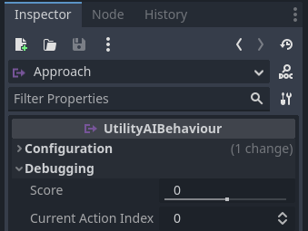
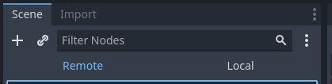
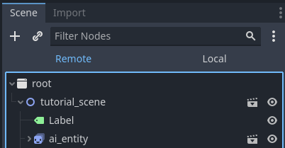
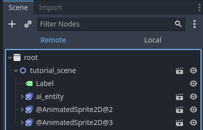
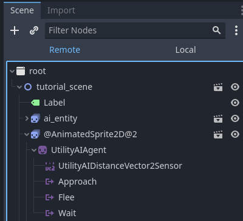
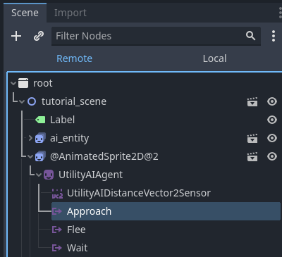
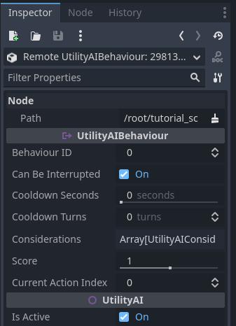

# Basic debugging

In this beginner tutorial, you will learn the basics of debugging the AI nodes. This tutorial uses the Agent Behaviour getting started tutorial project as an example. Once you have completed this tutorial, you will have understanding of the following:

 * How to see the properties during run-time
 * How to edit properties during run-time
 * Tips that help understand the AI state

**Contents:**

 1. [The Debugging property group](Basic_debugging.md#1-the-debugging-property-group)
 2. [Basic tips](Basic_debugging.md#2-basic-tips)

## 1. The Debugging property group

The agent behaviour nodes contain the **Debugging** property group which contains the current values of each of the run-time properties for the node. Below is an example of a **Behaviour** node and the contents of its Debugging property group:

When you are running your game in the **debug** mode, the properties within this group allow you to see what the node's current values are. You can also edit the values when your game is running.

To access these values, run your game (or scene) from the editor and then in the **scene-tab** click on the **remote** text.

This changes the scene tree to show node tree from the running game. You can expand the node groups like you would in the editor as usual. For instance, for the tutorial project your view may look something like this (not including the Label node):

If you have several AI entities in your scene, they will likely have automatically generated names:

When you expand one of the AI entity nodes, you can see the node instances of that particular AI entity:

To choose one of the behaviours, click one of them:

Then, in the **Inspector-tab**, you will see the current values for all of the properties:

You can **edit** these values through **the inspector-tab** and the changed values will be reflected in your game in real time. If you update the properties through code, that will override your manual input.  

This applies to all the nodes you create, both Utility AI GDExtension and everything else. Note that there can be a slight delay when the values in the inspector are updated. This is due to the way the remote debugging feature works in Godot.

## 2. Basic tips

Debugging in general can be hard and debugging game AI is no different. Here are some tips that can make it a bit easier. 

### Test behaviour selection and considerations in isolation

The remote debugging feature allows you to edit the property values of the nodes during runtime. This allows you to test how different inputs affect considerations and the scores of the behaviours. 

The steps are relatively easy: 
 * Set up the behaviour and considerations as you designed them
 * Don't write any code yet to update the sensors or consideration input values
 * Run the AI entity scene in debug mode, and set the values manually through the inspector
 * Observe the results by selecting the various nodes and examining the values in the inspector

This is useful especially if you have nested considerations with various activation curves and want to see how the scoring changes based on different input.

### Use labels to show the current behaviour/state/task

It is often useful to show the AI's state information directly in the game, next to the AI entity. A simple way of achieving this is to use the Label nodes. This makes it immediately obvious what the current state of each visible AI entity is. 

Some games use **barks** to do this so that it also helps the player to understand the AI's state better. Barks are audio cues, short voice comments or sounds, that the AI entity makes to indicate its state. In the Batman games the thugs yell "It's the bat!" or "He's here!" when they see the player before going to combat-state. They use further visual cues like stars circling above the thug's heads when they are in a stunned state. 

