# Getting started with Agent Behaviours

In this beginner tutorial, you will learn how Agent Behaviours work and you will build a simple AI entity that reacts to some input. Once you have completed this tutorial, you will have understanding of the following: 

 * What utility based Agent Behaviours are
 * How the Agent Behaviours work
 * How to construct utility based Agent Behaviours using Utility AI GDExtension

For this tutorial, we'll start with an empty Godot 4.1  project. 

**Contents:**

 1. [Project creation and installation of Utility AI GDExtension](Getting_started_with_Agent_Behaviours.md#1-project-creation-and-installation-of-utility-ai-gdextension)
 2. [Setting up the project and assets](Getting_started_with_Agent_Behaviours.md#2-setting-up-the-project-and-assets)
 3. [About Agent Behaviours](Getting_started_with_Agent_Behaviours.md#3-about-agent-behaviours)
 4. [Utility based Agent Behaviours in Utility AI GDExtension](Getting_started_with_Agent_Behaviours.md#4-utility-based-agent-behaviours-in-utility-ai-gdextension)
 5. [Creating the scenes](Getting_started_with_Agent_Behaviours.md#5-creating-the-scenes)
 6. [Creating Agent Behaviours for the AI-entity](Getting_started_with_Agent_Behaviours.md#6-creating-agent-behaviours-for-the-ai-entity)
 7. [Adding the code](Getting_started_with_Agent_Behaviours.md#7-adding-the-code)
 8. [Running the main scene](Getting_started_with_Agent_Behaviours.md#8-running-the-main-scene)
 9. [Next steps](Getting_started_with_Agent_Behaviours.md#9-next-steps)


## 1. Project creation and installation of Utility AI GDExtension

Before we can begin, we need to create and setup the project, and add the assets we are going to use. To create a new Godot Engine project that uses Utility AI GDExtension, follow these steps: 


1. Open Godot Engine.


2. Click **New project**.

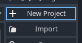


3. Then give the project a name and click the **Create folder** button.

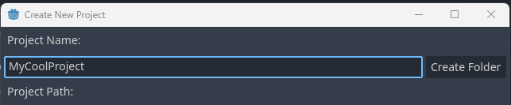


4. Choose the renderer you want to use, and then click **Create & Edit**.


5. The Godot Engine Editor main scene will open up.


To install the Utility AI GDExtension addon, follow the [installation instructions](How_to_install_Utility_AI_GDExtension.md).

Once you have installed the extension, we are ready to set up the project and prepare the assets.


## 2. Setting up the project and assets

For this project we are going to use the assets used in the *example project*. Go to the [Releases](https://github.com/JarkkoPar/Utility_AI_GDExtension/releases) and download the latest version of the example project.


1. Open your Godot project and create a folder named **Assets** in the project root folder.


2. Open the example project folder you downloaded and copy the **"Standard sprites upd.png"** file to your own project, the Assets-folder.


You now have all the assets we need for this tutorial. The setup in your FileSystem tab should look like this:

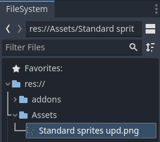<br>


Before we start, let's review what *agent behaviours* are.


## 3. About Agent Behaviours

Agent Behaviours are a utility-function based AI system for creating AI to your non-playable characters. The system uses **sensors** to get data about the game world, **behaviours** and **considerations** to choose the correct behaviour, and optional **actions** to realize the selected behaviour. The considerations use **curves** to weight the sensor input, allowing you to tune the importance of various inputs to your liking.

The use of utility functions for the behaviours means that the AI entity can react to world state by weighting its options against one another. Where *behaviour trees* and *state trees* are more static when selecting which nodes to activate, the utility based agent behaviours can consider several variables and even combine them to come to a conclusion on which behaviour is the most appropriate for the situation.

You can use the agent behaviours together with the state trees and behaviour trees. For instance, the agent behaviours can be used to select the top-level behaviour and the behaviour or state trees can be used to realize the behaviour.


### 3.1 The structure of the Agent Behaviours

The structure of the agent behaviours controls the decision making for your AI entity. Agent behaviours consists of a **AI Agent** node that is the basis of the structure. The AI Agent gets input from the game world by using **sensors**. The sensor nodes are added as the child nodes of the AI Agent node.

The *behaviours* the AI Agent will choose from are defined using the **Behaviour** nodes. The behaviours are added as child nodes to the AI Agent.

Each behaviour needs **Considerations** as either their child nodes or as a property in the *Inspector*. The considerations are used to **score** the behaviours. The AI Agent will choose its behaviour amongst the top-scoring behaviours.

The *considerations* can be grouped and the score for a behaviour will be aggregated based on the consideration structure created for it. Each consideration has an **activation curve** property, that affects its **score**. 

The *behaviours* contain **actions** that are executed when a behaviour is active. The use of actions isn't strictly necessary, but they allow the creation of sequences of actions.


### 3.2 The update methods for the Agent Behaviours

The AI Agent is updated by calling its `evaluate_options()` method. This method will update all the **sensors** and evaluate all the **behaviour groups** and **behaviours** that are child nodes of the **AI agent**. Based on the evaluation it will choose a behaviour as the active behaviour. When this happens, the **behaviour_changed signal** is emitted. 

The `evaluate_options()` method evaluates the behaviours in top-to-down order and places them to a list based on their score. If two behaviours get the same score, the one that is evaluated first gets higher priority. As an example, this means that in a situation where you want to choose top 3 behaviours out of 10 and you already have evaluated 3 behaviours, if the any of the later ones get the same score as the behaviour at third place, the later behaviour gets discarded. If later evaluated behaviour gets the same score as the second one, it will be placed third in the list.  

If *actions* are used, the `update_current_behaviour()` method is then called to choose an action to perform. When an action gets selected the **action_changed()** signal is emitted. If a behaviour has no actions set as its child nodes, the `update_current_behaviour()` will exit and emit the **behaviour_changed()** signal with a **null** behaviour.

When choosing the behaviour the `evaluate_options()` method will check if the **Can be interrupted** property of the currently active behaviour is set. If it is, the behaviours will be evaluated. If not, the `evaluate_options()` method will exit. When using the *can be interrupted* property for a behaviour you can end a behaviour by setting all its child actions as finished by assigning their **is_finished** property as true. If the behaviour does not have action nodes as its childs, you can end the behaviour by calling the AI Agent's `update_current_behaviour()` method.


### 3.3 Challenges with utility based systems

One of the callenges with utility based systems comes from their strength: defining how the utility is calculated can be complex. The needed inputs can be many and setting a suitable curves or combinations of curves for them can be harder than you initially think. 

Another issue can be *oscillation* between behaviours. The AI entity moves between two or more behaviours due to changes in the inputs and how the considerations weight them. This issue can be mitigated by using *cooldowns* and/or bias towards the currently active behaviour. 


## 5. Creating the scenes

The agent behaviour nodes work with both 2D and 3D scenes. For this tutorial we are creating everything in 2D because setting up the assets for 2D scenes is much quicker.

We will create two scenes: a **main scene** in which we will spawn our AI-entities in, and a **ai_entity** scene that is the AI-entity we will be creating.


### 5.1 Creating the scene bases and adding animation to the AI-entity


1. In your Godot Project, create a Node2D-based scene, name it as **tutorial_scene** and save it.

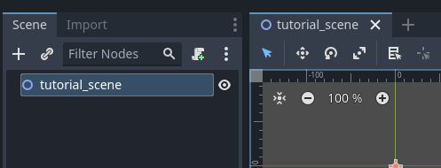<br>

This will be our *main scene* and we will *instantiate* the AI entities in to this scene.  The AI entity itself will be a separate AnimatedSprite2D scene with agent behaviour nodes.


2. Create a new AnimatedSprite2D-based scene and name it as **ai_entity**.

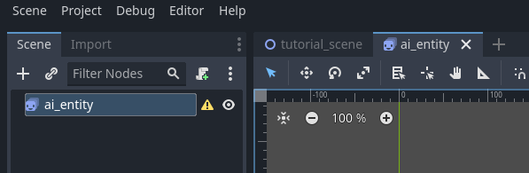<br>


3. In the **ai_entity** scene, select the ai_entity AnimatedSprite2D in the **Scene-tab** and then in the **Inspector-tab** expand the **Animation** group.

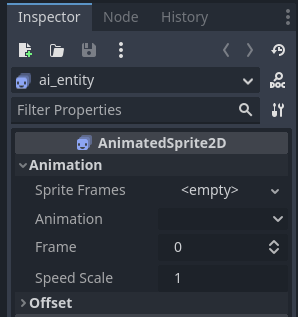<br>


4. In the popup menu, choose **New SpriteFrames**. This will create a new SpriteFrames resource for the AnimatedSprite2D.

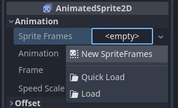<br>


5. Click the created SpriteFrames again to select it. This will open up the **SpriteFrames menu** at the bottom of the Godot Editor. The next steps will take place in that menu.

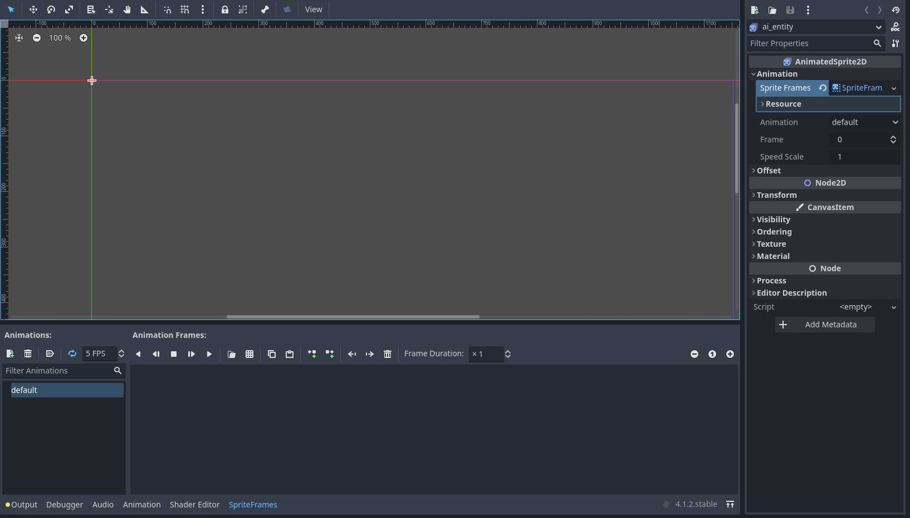<br>


6. Make sure the "default" animation is selected, then click on the "Add frames from sprite sheet" icon.

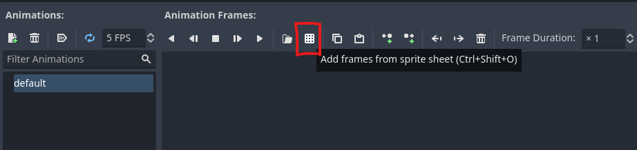<br>


7. Open file dialog will open up. Go to the Assets-folder and select the file **Standard sprites upd.png**, then click **Open**.

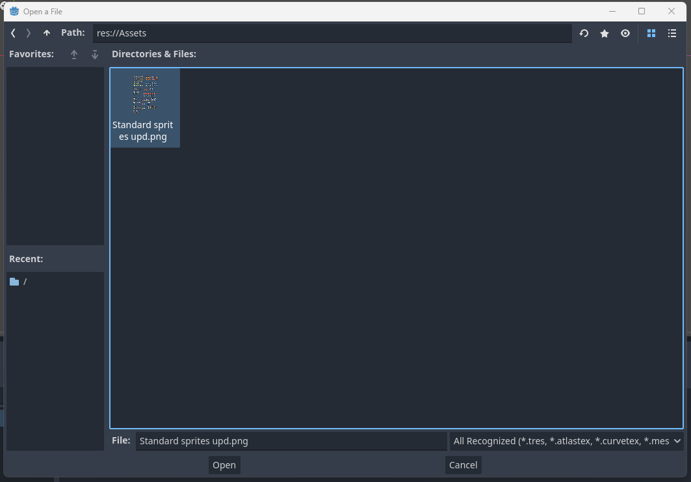<br>


8. The **Select frames** will open up. On the right-side of the dialog, change the **Size** to 16px in width and 16px in height. The grid should then match the sprites on the spritesheet.

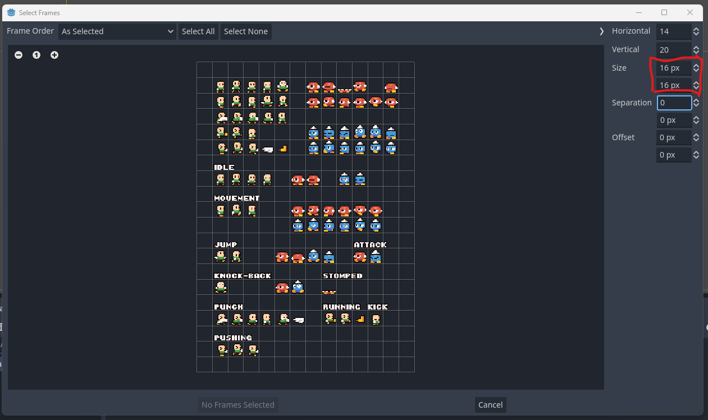<br>


9. The **default** animation will be the idle-pose for the **ai_entity**. Choose which ever creature you want from the sprite sheet and select its idle animation frames, then click the **Add X Frame(s)** button (X will be the number of frames you've selected.

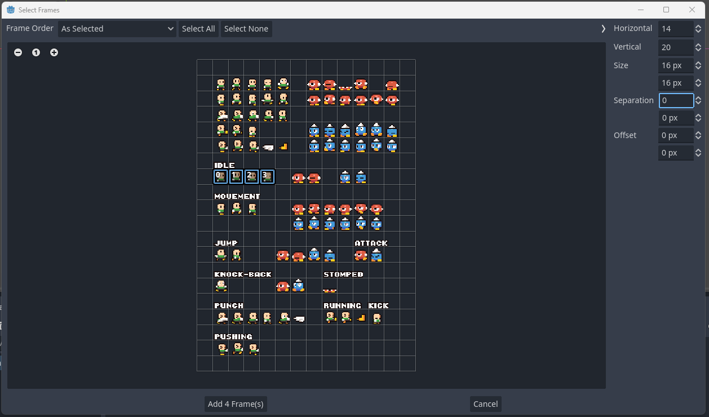<br>


10. In the **SpriteFrames menu**, make sure that the **Autoplay on Load** has been selected for the **default** animation.

<br>


11. Create a new animation by clicking the **Add animation** button and set its name as **moving**. Then add movement frames similarly as we did for the *default* animation in the prior steps.

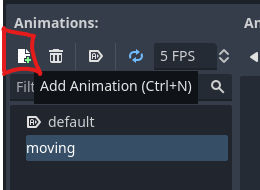<br>


12. If you haven't saved your project yet after adding the new scenes, do it now.


### 5.2 Adding spawning to the main scene


1. Go to the **tutorial_scene** tab in the editor. In the **scene-tab** make sure the **tutorial_scene** Node2D is selected and then click the **Attach a new or existing script to the selected node** button.

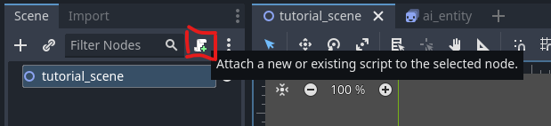<br>
 


2. In the **Attach Node Script** dialog, you can leave everything to defaults and click the **Create** button.

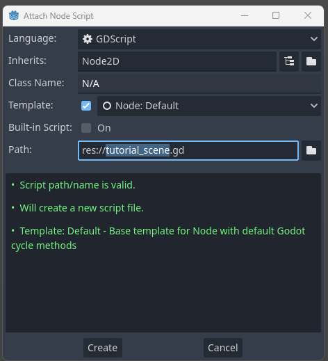<br>


3. The **Script editor** should be automatically shown. If not, choose it from the menu at the top of the editor view. You should see the following code:

```gdscript
extends Node2D


# Called when the node enters the scene tree for the first time.
func _ready():
	pass # Replace with function body.


# Called every frame. 'delta' is the elapsed time since the previous frame.
func _process(delta):
	pass

```

This is the default code given if you kept the default settins when creating the script. Replace the code with the following (see explanation for it below):

```gdscript
extends Node2D

@onready var ai_entity_template:PackedScene = preload("res://ai_entity.tscn")
var mouse_position:Vector2


# Called when the node enters the scene tree for the first time.
func _ready():
	randomize()
	# For convinience in changing the number of AI-entities to create
	var num_entities:int = 1
	
	# Create all the entities.
	for i in range(0, num_entities):
		# Instantiates an AI-entity.
		var new_ai_entity:Node2D = ai_entity_template.instantiate()
		# Sets a random position somewhere on the screen for the AI-entity.
		new_ai_entity.position = Vector2( randf() * get_viewport_rect().end.x, randf() * get_viewport_rect().end.y)
		# Adds the AI-entity to the scene.
		add_child(new_ai_entity)


func _physics_process(delta):
	# Set the mouse cursor position as the to-vector.
	mouse_position = get_viewport().get_mouse_position()


```

This code will instantiate the given number of AI-entities to the main scene to random positions. 

 * On the row The `@onready var ai_entity_template:PackedScene = preload("res://ai_entity.tscn)` we load the **ai_entity** scene which we will use to instantiate the AI entities in the **_ready()** method.
 * After that we create a variable **mouse_position** that the AI entities will use to check where the mouse cursor is.
 * In the **_ready()** method we first set the number of entities to instantiate as 1 in `var num_entities:int = 1`. Then in the **for-loop** we first use the `instantiate()` method of the loaded *ai_entity* scene to create a new instance of the AI entity, we then set a random position for it, and finally add it to the *main scene* by adding it as a child using the `add_child(new_ai_entity)` method. 
 * In the **_physics_process(delta)** method the only thing we do is set the `mouse_position` variable as the current position. We do this once in the main scene, as finding the mouse position is a surprisingly costly operation and calling this method for each AI entity can get quite costly when you add more of them.

We are now done with the main scene. Next we will focus on creating the **ai_entity** scene with Agent Behaviour based AI.


## 6. Creating the Agent Behaviour for the AI entity


1. Select the **ai_entity** scene in the editor.


2. In the **scene-tab**, right-click on the **ai_entity AnimatedSprite2D** node and choose **Add Child Node**.

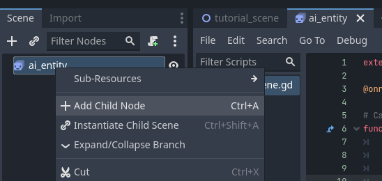<br>


3. Choose the **UtilityAIAgent** node and add it to the scene by clicking the **Create** button. The AI Agent node will be the node we will be updating later in code.

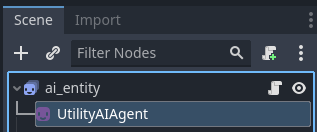<br>

In the inspector, set the **Thinking Delay in Seconds** property as **0**.

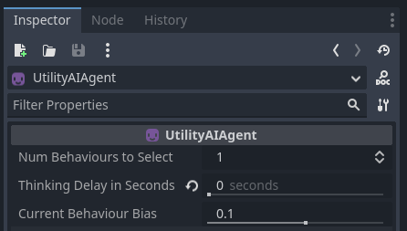<br>


4. We'll use a **Sensor** to track the distance and direction vector to the mouse cursor. Right-click on the **UtilityAIAgent** node you created and add a **UtilityAIDistanceVector2Sensor** as its child node. 

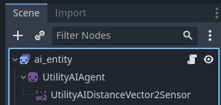<br>

In the **Inspector** make sure to check the boxes for **Is Distance Calculated** and **Is Direction Vector Calculated** for the distance sensor. Then update the **Max Distance** property to **200**.

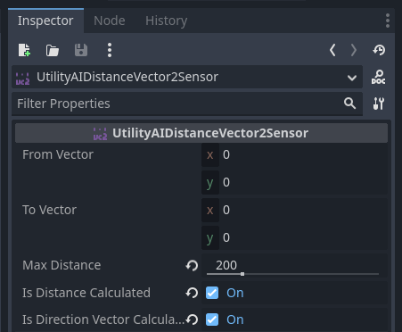<br>


5. Add another child node to the UtilityAIAgent node, this time a **UtilityAIBehaviour**. This will be one of the states the AI entity will have. 

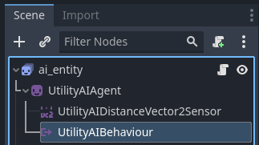<br>


6. Rename the UtilityAISTNode as **Approach**. 

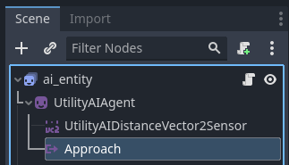<br>


7. Add two UtilityAIBehaviour under the UtilityAIAgent node and name them as **Flee** and **Wait**. 

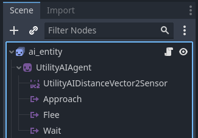<br>


Next we will add the **Considerations** that will be used to choose which behaviour becomes active.

8. Add a **UtilityAIConsideration** node under the **Approach** node and name it as **Do I need to go closer?**. 

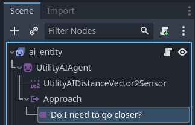<br>


9. With the **Do I need to go closer?** node selected, go to the **Inspector**. Set the **Sensor** property as the **UtilityAIDistanceVector2Sensor**.

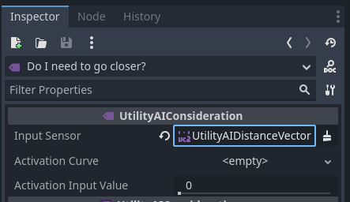<br>


10. Continuing in the **Inspector** for the consideration, add an **activation curve** by clicking on the property and selecting **New curve**.

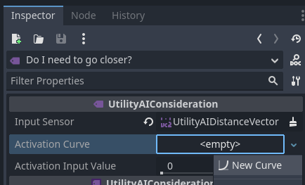<br>


10. The curve should get added and you should see the **curve editor** in the Inspector. If not, click on the curve you created. Add two points to the curve, one at Y=0 and slightly to the left of 0.5 on the X-axis, and another at Y=1 slightly to the right of the X-axis. The reason we create the curve like this is connected to the **sensor**. If you remember, we set the **Max Distance** property to 200. The X-axis value 0.5 will therefore be 0.5 * 200 = 100. If the sensor value is greater or equal to 100, then the **Do I need to go closer?* consideration will get a score of 1, and 0 otherwise.

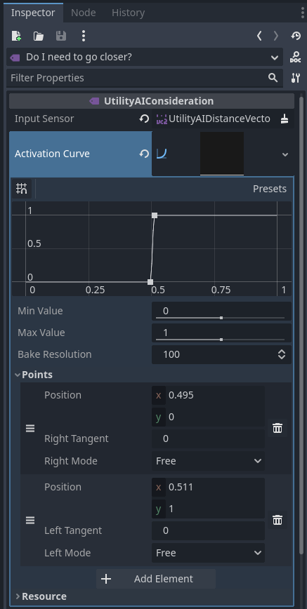<br>

10. Create another **consideration** under the **Flee** node and rename it as **Do I need to get away?**. In the inspector, set the sensor similarly to step 6.9 and then set the curve as in the image below.

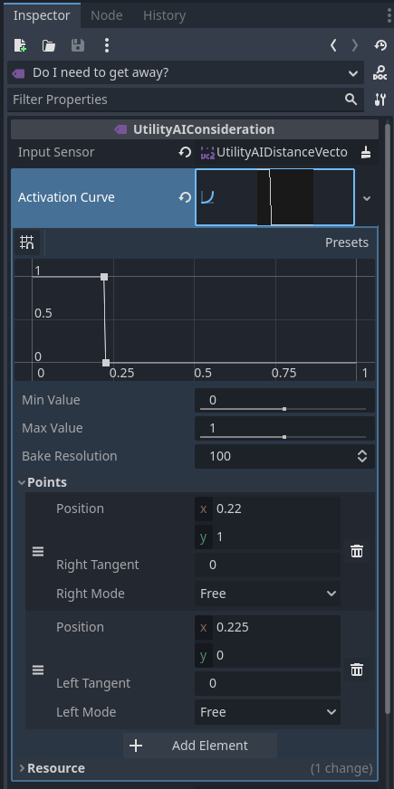<br>

11. Create one more consideration under the **Wait** node and rename it as **Do I just idle?**. In the inspector, set the sensor as before and then set the curve as in the image below (NOTE! Just one point!).

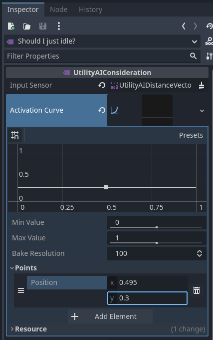<br>


We have now created the behaviour structure for the AI Agent. What is missing are ai_entity related code to handle the behaviour changes and movement.


## 7. Adding the code


1. In the **ai_entity** scene, in the **Scene-tab**, attach a script to the **ai_entity** node. Replace the code with the following code (see explanation for it below):

```gdscript
extends AnimatedSprite2D

# This is the distance sensor. 
@onready var sensor_distance:UtilityAIDistanceVector2Sensor = $UtilityAIAgent/UtilityAIDistanceVector2Sensor
var movement_speed:float = 0.0


func _physics_process(delta):
	# Set the AI-entity position as the from-vector.
	sensor_distance.from_vector = global_position
	
	# Set the mouse cursor position as the to-vector.
	sensor_distance.to_vector = get_parent().mouse_position 
	
	# Update the AI.
	$UtilityAIAgent.evaluate_options(delta)
	
	# Move based on movement speed.
	self.global_position += sensor_distance.direction_vector * movement_speed * delta
	
	# Flip the sprite horizontally based on the direction vector horizontal (x)
	# value.
	flip_h = (sensor_distance.direction_vector.x < 0)
	# If the movement speed is negative, the entity is moving away so
	# we should flip the sprite again.
	if movement_speed < 0.0:
		flip_h = !flip_h


func _on_utility_ai_agent_behaviour_changed(behaviour_node):
	if behaviour_node == null:
		return
	
	if behaviour_node.name == "Approach":
		movement_speed = -100
		play("moving")
	elif behaviour_node.name == "Flee":
		movement_speed = 100
		play("moving")
	else:
		movement_speed = 0
		play("default")


```

What this code does:
 * The row `@onready var sensor_distance:UtilityAIDistanceVector2Sensor = $UtilityAISTRoot/UtilityAIDistanceVector2Sensor` gets a reference to the Vector2 based distance sensor of the AI entity. This sensor is used to check the distance and to get the direction vector towards the target.
 * The row `var movement_speed:float = 0.0` defines a variable that we will use to control the movement speed of the AI entity.
 * In the `_physics_process(delta)` method we first set the distance sensor **from-position** as the global position of the AI entity, and the **to-position** as the location of the mouse cursor from the parent node. The sensor will use these two positions to calculate the distance from the AI entity to the mouse cursor, and also the direction vector that we will use later for movement.
 * `$UtilityAIAgent.evaluate_options(delta)` evaluates which behaviour should be activated. It will **emit the behaviour_changed** signal when a behaviour changes.
 * After *evaluating the options* for the AI Agent node, the row `self.global_position += sensor_distance.direction_vector * movement_speed * delta` moves the AI entity based on the direction vector calculated by the distance sensor. Delta time is used to scale the movement amount. The `movement_speed` is set by the selected behaviour.
 * The final rows of the `_physics_process()` method make sure the character sprite is facing the direction it is moving to by flipping the sprite horizontally when needed.
 * At the end of the script, we have the method `_on_utility_ai_agent_behaviour_changed(behaviour_node)`. This is a signal hander for a signal we will shortly create. It checks that the new behaviour is not null, and then uses the behaviour **name** to determine how to set up the **movement_speed** and which animation to play. Alternatively the **Behaviour ID** property could be used to differentiate between the behaviours.


> [!NOTE]
> For this tutorial we are calling the AI Agent node `evaluate_options()` method every physics frame. This isn't what you usually want to do in a real game. See section [9. Next steps](Getting_started_with_Agent_Behaviours.md#9-next-steps) for more information.


2. In the **ai_entity** scene, **select the UtilityAIAgent** node and go to the **Node-tab**. Make sure **Signals** is selected and then double click on the **behaviour_changed(behaviour_node: Object)** signal.

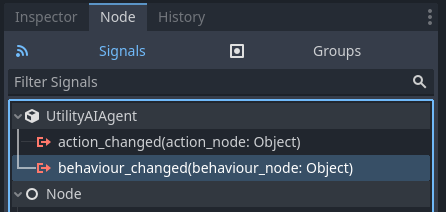<br>


3. Connect the signal to the **ai_entity** scene by clicking the **Connect** button. The method name should automatically match the one we had in the script in step 7.1.

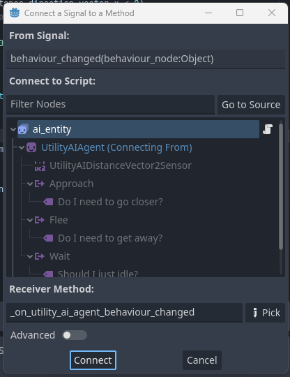<br>


## 8. Running the main scene

Now that we've added the logic for the AI in the form of the Agent Behaviours and the needed script code, you can select the **tutorial_scene** and run it. As you move the mouse cursor, the AI entity should move closer to the cursor if it is too far away and farther away if the cursor gets too close. 

To change the number of AI entities created, change the `num_entities` variable to a larger value in the **tutorial_scene**.


## 9. Next steps

This concludes the tutorial, but there are things you can try to learn more. For instance:

 * Try adding some more logic to the tutorial scene, for instance a point that the AI entities want to avoid, an animation they will some times play when they are not moving or an item they can pick up.
 * Try adding another type of AI entity that has some other logic for its behaviour. 
 * Try setting the the `num_entities` to a larger value in the **tutorial_scene**. How many AI entities you can add without it affecting performance? 

In 7.1 it was noted that you usually don't want to tick the tree every physics frame. There are several reasons for this. For one, the game world usually doesn't change dramatically each frame and as a result the AI Agent would end up choosing the same behaviour as it did on the previous frame. Secondly, updating the AI Agent each frame has of course a cost. If the updating doesn't result in a change in the behaviour and it costs some frame time, it doesn't make sense to do the updating unless it is necessary. Thirdly, we humans (and also animals in general) have various *reaction times* that cause some delay when we are reacting to the changes in our environment. Adding some delay may make your AI entities more *believable* and fun. Finally, updating the AI Agent every frame can lead to a practice of adding per-frame logic inside the AI, which in turn can lead to a unnecessarily complex AI structure. 

Some of the ways to tick the state tree less often can be:
 * Add a delay or cooldown. Each time you update the AI Agent, you set a variable in the **ai_entity** node to some short time duration and then tick the tree only after this time has passed. An example of this is given below.
 * Evaluate the AI Agent options based on **events**. For example, if you have an Area2D or Area3D that you use for sensing the environment, you can evaluate what the AI Agent should do when an enemy enters or exits the area. Another examples could be the AI entity losing or gaining more health, getting an alarm signal, and so on.

To see the difference of adding some delay to updateing the AI agent, test how the code below for the **ai_entity** script changes the way the AI works. The only thing it adds is the `ticking_delay` variable that introduces a minimum delay plus a random variance to when the updating occurs. You can try adding different delays and how it affects performance and the AI reaction times.

```gdscript
extends AnimatedSprite2D

# This is the distance sensor. 
@onready var sensor_distance:UtilityAIDistanceVector2Sensor = $UtilityAIAgent/UtilityAIDistanceVector2Sensor
var movement_speed:float = 0.0
var ticking_delay:float = 0.0


func _physics_process(delta):
	# Set the AI-entity position as the from-vector.
	sensor_distance.from_vector = global_position
	
	# Set the mouse cursor position as the to-vector.
	sensor_distance.to_vector = get_parent().mouse_position 
	
	# Update the AI.
	ticking_delay -= delta
	if ticking_delay <= 0.0:
		ticking_delay = 0.3 + randf() * 0.3
		$UtilityAIAgent.evaluate_options(delta)
	
	# Move based on movement speed.
	self.global_position += sensor_distance.direction_vector * movement_speed * delta
	
	# Flip the sprite horizontally based on the direction vector horizontal (x)
	# value.
	flip_h = (sensor_distance.direction_vector.x < 0)
	# If the movement speed is negative, the entity is moving away so
	# we should flip the sprite again.
	if movement_speed < 0.0:
		flip_h = !flip_h


func _on_utility_ai_agent_behaviour_changed(behaviour_node):
	if behaviour_node == null:
		return
	
	if behaviour_node.name == "Approach":
		movement_speed = -100
		play("moving")
	elif behaviour_node.name == "Flee":
		movement_speed = 100
		play("moving")
	else:
		movement_speed = 0
		play("default")


```
