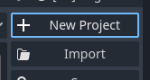
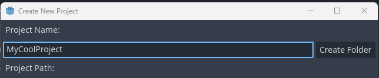

# Getting started with Behaviour Trees

In this beginner tutorial, you will learn how Behaviour Trees work and you will build a simple AI entity that reacts to some input. Once you have completed this tutorial, you will have understanding of the following: 

 * What a Behaviour Tree is
 * How a Behaviour Tree works
 * What *ticking the tree* means, and
 * How to construct a behaviour tree using Utility AI GDExtension

For this tutorial, we'll start with an empty Godot 4.1  project. 

Contents:

 1. [Project creation and installation of Utility AI GDExtension](Getting_started_with_Behaviour_Trees.md#project-creation-and-installation-of-utility-ai-gdextension)
 2. [Setting up the project and assets](Getting_started_with_Behaviour_Trees.md#setting-up-the-project-and-assets)
 3. [About Behaviour Trees](Getting_started_with_Behaviour_Trees.md#about-behaviour-trees)
 4. [Utility enabled Behaviour Trees in Utility AI GDExtension](Getting_started_with_Behaviour_Trees.md#utility-enabled-behaviour-trees-in-utility-ai-gdextension)

## 1. Project creation and installation of Utility AI GDExtension

Before we can begin, we need to create and setup the project, and add the assets we are going to use. To create a new Godot Engine project that uses Utility AI GDExtension, follow these steps: 

1. Open Godot Engine.

2. Click **Create project**.

3. Then give the project a name and click the **Create folder** button.

4. Choose the renderer you want to use, and then click **Create & Edit**.

5. The Godot Engine Editor main scene will open up.

To install the Utility AI GDExtension addon, follow the [installation instructions](How_to_install_Utility_AI_GDExtension.md).

Once you have installed the extension, we are ready to set up the project and prepare the assets.

## 2. Setting up the project and assets

For this project we are going to use the assets used in the *example project*. Go to the [Releases](https://github.com/JarkkoPar/Utility_AI_GDExtension/releases) and download the latest version of the example project.

todo: add asset guide

## 3. About Behaviour Trees

## 4. Utility enabled Behaviour Trees in Utility AI GDExtension

