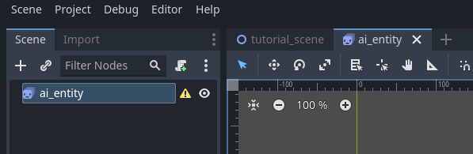
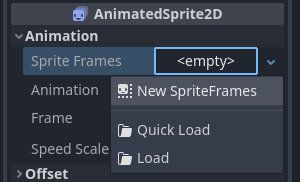
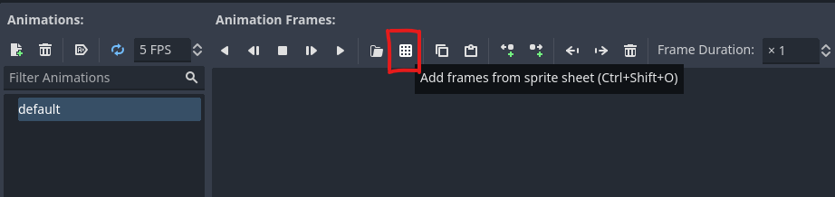
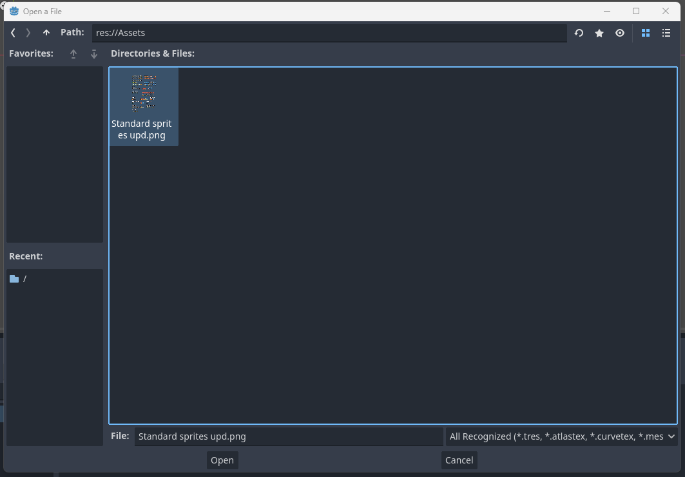
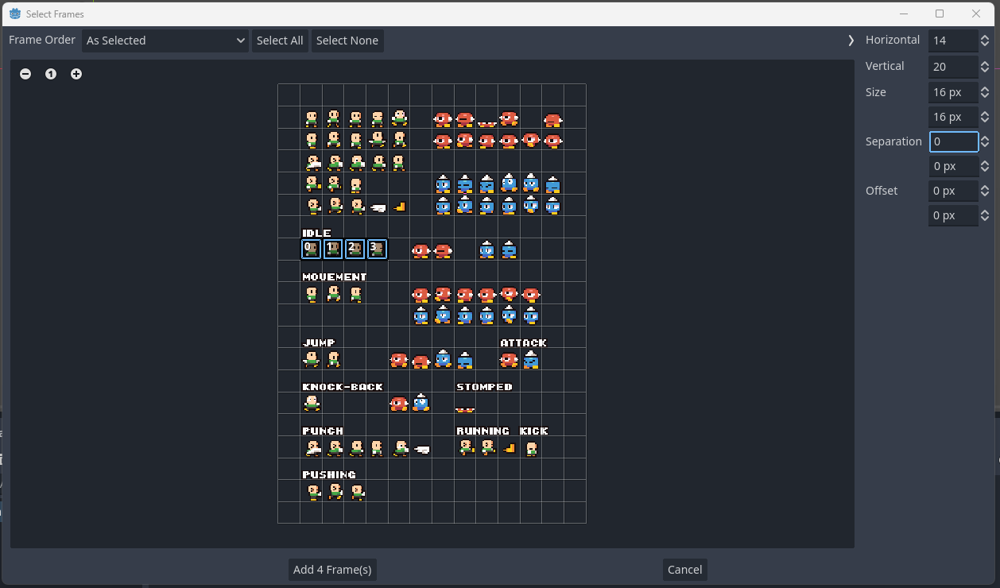
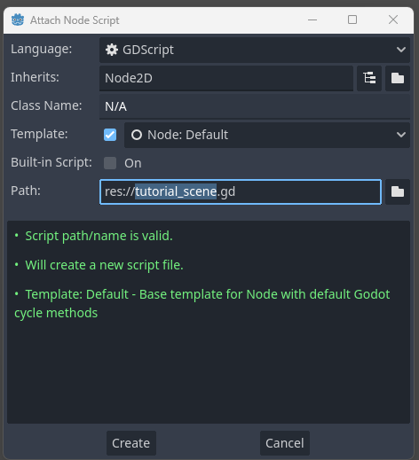
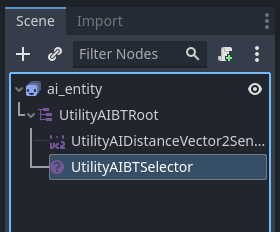

# Getting started with Behaviour Trees

In this beginner tutorial, you will learn how Behaviour Trees work and you will build a simple AI entity that reacts to some input. Once you have completed this tutorial, you will have understanding of the following: 

 * What a Behaviour Tree is
 * How a Behaviour Tree works
 * What *ticking the tree* means, and
 * How to construct a behaviour tree using Utility AI GDExtension

For this tutorial, we'll start with an empty Godot 4.1  project. 

**Contents:**

 1. [Project creation and installation of Utility AI GDExtension](Getting_started_with_Behaviour_Trees.md#1-project-creation-and-installation-of-utility-ai-gdextension)
 2. [Setting up the project and assets](Getting_started_with_Behaviour_Trees.md#2-setting-up-the-project-and-assets)
 3. [About Behaviour Trees](Getting_started_with_Behaviour_Trees.md#3-about-behaviour-trees)
 4. [Utility enabled Behaviour Trees in Utility AI GDExtension](Getting_started_with_Behaviour_Trees.md#4-utility-enabled-behaviour-trees-in-utility-ai-gdextension)
 5. [Creating the scenes](Getting_started_with_Behaviour_Trees.md#5-creating-the-scenes)
 6. [Creating the AI-entity](Getting_started_with_Behaviour_Trees.md#6-creating-the-ai-entity)


## 1. Project creation and installation of Utility AI GDExtension

Before we can begin, we need to create and setup the project, and add the assets we are going to use. To create a new Godot Engine project that uses Utility AI GDExtension, follow these steps: 


1. Open Godot Engine.


2. Click **New project**.


3. Then give the project a name and click the **Create folder** button.


4. Choose the renderer you want to use, and then click **Create & Edit**.


5. The Godot Engine Editor main scene will open up.


To install the Utility AI GDExtension addon, follow the [installation instructions](How_to_install_Utility_AI_GDExtension.md).

Once you have installed the extension, we are ready to set up the project and prepare the assets.


## 2. Setting up the project and assets

For this project we are going to use the assets used in the *example project*. Go to the [Releases](https://github.com/JarkkoPar/Utility_AI_GDExtension/releases) and download the latest version of the example project.

1. Open your Godot project and create a folder named **Assets** in the project root folder.

2. Open the example project folder you downloaded and copy the **"Standard sprites upd.png"** file to your own project, the Assets-folder.


You now have all the assets we need for this tutorial. The setup in your FileSystem tab should look like this:

<br>


Before we get started with development, it is good review what Behaviour Trees are. If you already are experienced in using behaviour trees, you can hop on to [4. Utility enabled Behavour Trees in Utility AI GDExtension](Getting_started_with_Behaviour_Trees.md#4-utility-enabled-behaviour-trees-in-utility-ai-gdextension) to learn how the utility enabled behaviour trees in Utility AI GDExtension expand the classical Behaviour Tree functionality. Otherwise, read on.


## 3. About Behaviour Trees

Behaviour trees are probably the most popular system for AI in games today. They are easy to understand and intuitive to create for many and it is easy to make changes to them. You can think of a behaviour tree as a *plan* on how to reach a certain goal by choosing and executing various tasks. Its structure is modular and it is possible to execute very complex tasks just by composing them from simpler tasks. 

The flexibility of behaviour trees allows you to develop your AI iteratively: you start by creating basic behaviour and decision making, then add more detail and alternative ways of reaching goals to the tree by adding new branches. 


### 3.1 The structure of a Behaviour Tree

The structure of the behaviour tree controls the flow of decision making for your AI entity. A behaviour tree consists of a **root node** that is the basis of the tree. The tree branches are created using **composite nodes** that define how the tree is traversed together with **decorator nodes**, and finally the branches of the behaviour tree end with **task nodes** that execute various actions. Using a behaviour tree a non-player character can make choices on what are the best actions it can take in the situation where it finds itself in.

A behaviour tree is updated by **ticking** the tree. Simplified, this means that the root node of the tree is first updated, which in turn updates its child node, and the child node updates its own child nodes and so on, until one or more *task nodes* are reached. You can think of ticking as *executing what ever code the behaviour tree nodes have and returning if it succeeded or not*. 

For most of the nodes the ticking code is pre-defined by the behaviour tree implementation. For example the *sequence* and *selector* have a set logic they execute during a tick. You usually add your own code to the *task nodes* by defining the `on_tick()` method.

The ticking of the child nodes is done in a top-to-down order. The higher the node is in the list, the higher its priority. 

<br>
*Node priority is highest on the top, lowest on the bottom.*<br>


### 3.2 The return values of the Behaviour Tree nodes

Each behaviour tree node returns a value, which is either *success*, *failure* or *running*. Usually it is one of the task nodes that ultimately sets what value is returned but the decorator and composite nodes can affect the value that is returned to the root node in the end.
 
The return value is predetermined for most of the node types, but you decide what each *task node* will return. In Utility AI GDExtension the numerical values for these are as follows:

 * **Running** 0
 * **Succeeded** 1
 * **Failed** -1

> [!NOTE]
> In Utility AI GDExtension the nodes can also return the *skip* value, but for the purposes of this tutorial we will only focus on the *success*, *failure* and *running* values. The numerical value for *skip* is -2.


### 3.3 Commonly used nodes

All behaviour trees need the **root** node. The root node is the *main node* for behaviour trees. The root node always has only one behaviour tree child node (in Utility AI GDExtension it may have **Sensor** nodes as well).

In addition to the root node, **task** or **leaf** nodes are always needed. As the *task* node's name implies, these nodes usually execute actions and other logic.

The most commonly used *composite* nodes are the **selector** (also known as the *fallback*) node and the **sequence** node. 

 * The selector *ticks* (= runs the code) its child nodes one by one and checks if any of its child nodes succeeds. When one does, it stops ticking and returns *success* back to its parent node. If all fail, it returns back *failure* to its parent.  
 * The sequence *ticks* its child nodes one by one until one of them fails or until it has ticked all its child nodes. If a child node fails, the sequence returns *failure* back to its parent. If all succeed, it returns back *success*.

Both the selector and sequence return back *running* if a child node they tick returns back running. Handing the *running* state can vary between Behaviour Tree implementations. In Utility AI GDExtension the default is that during the next tick the tree continues ticking from the node that returned running until it either succeeds or fails. This can be changed by editing the `reset_rule` property.

There are also *decorator* nodes, which usually have only one child node. The **inverter** is a very common one, and it changes the return value of its child node to the opposite value (a *success* becomes a *failure* and a *failure* a *success*; *running* stays as *running*). Other common decorator nodes are the **repeat until** node that repeats its child node until it either succeeds or fails, **cooldown** nodes run their child nodes and then allow it only to run after a certain cooldown period.

> [!NOTE]
> The *AlwaysSucceed* and *AlwaysFail* nodes are replaced by the **FixedResult** decorator node in Utility AI GDExtension, where you can choose what result the node always returns.


### 3.3 Challenges with behaviour trees

While behaviour trees are very good at choosing which tasks to execute at each moment, they aren't very good at handling (or visually representing) *states*. 

Moving between states is usually **cyclic**, meaning that you can transition between various states and even go back and forth between them. For instance, your AI can start in a *Patrol* state and transition to *Idle* or *Combat* states and back to *Patrol* state again. Behaviour Trees are **acyclic**. They start from the root node and then plummet down the tree, ticking the nodes, until they land on some task node. The task node may be within a branch that realizes the behaviour that can be associated with a *Patrol*, *Idle* or *Combat* state, but the tree itself is oblivious of this state. 

If you find yourself wanting to move between states while building your behaviour tree, you should read up on [**State Trees**](Getting_started_with_State_Trees.md) and consider implementing your logic there instead. 


## 4. Utility enabled Behaviour Trees in Utility AI GDExtension

You can use the utility enabled Behaviour Trees as the sole AI reasoning component, or as a sub-component of the AI Agent Behaviours or State Trees. Utility-based considerations can be attached to all of the nodes in Utility AI GDExtension, including the Behaviour Tree nodes. The considerations can be attached either as child nodes or in the Inspector as a property.

<br>
*Considerations can be child nodes or in the Inspector as properties.*<br>

The **score based picker** node can be placed anywhere in the behaviour tree and during a *tick* it will first evaluate the *considerations* attached to its child nodes to find out which child node scores the highest, and then proceed to tick that node. 

It is possible to start **Node Query System** queries from the Behaviour Trees by using the **RunNQSQuery** node. To do this, you need a *Search Space* that has been setup elsewhere in your scene. The RunNQSQuery node will post the query and return *running* until the query completes, in which case the RunNQSQuery node returns *success*.

> [!NOTE]
> When using the RunNQSQuery node, it is expected that you call the `NodeQuerySystem.run_queries()` method once per physics frame in your main scene.


## 5. Creating the scenes

The behaviour tree nodes work with both 2D and 3D scenes. For this tutorial we are creating everything in 2D because setting up the assets for 2D scenes is much quicker.

We will create two scenes: a **main scene** in which we will spawn our AI-entities in, and a **ai_entity** scene that is the AI-entity we will be creating.

### 5.1 Creating the scene bases and adding animation to the AI-entity

1. In your Godot Project, create a Node2D-based scene, name it as **tutorial_scene** and save it.

<br>

This will be our *main scene* and we will *instantiate* the AI entities in to this scene.  The AI entity itself will be a separate AnimatedSprite2D scene with a behaviour tree.


2. Create a new AnimatedSprite2D-based scene and name it as **ai_entity**.

<br>


3. In the **ai_entity** scene, select the ai_entity AnimatedSprite2D in the **Scene-tab** and then in the **Inspector-tab** expand the **Animation** group.

<br>


4. In the popup menu, choose **New SpriteFrames**. This will create a new SpriteFrames resource for the AnimatedSprite2D.

<br>


5. Click the created SpriteFrames again to select it. This will open up the **SpriteFrames menu** at the bottom of the Godot Editor. The next steps will take place in that menu.

<br>


6. Make sure the "default" animation is selected, then click on the "Add frames from sprite sheet" icon.

<br>

7. Open file dialog will open up. Go to the Assets-folder and select the file **Standard sprites upd.png**, then click **Open**.

<br>


8. The **Select frames** will open up. On the right-side of the dialog, change the **Size** to 16px in width and 16px in height. The grid should then match the sprites on the spritesheet.

<br>


9. The **default** animation will be the idle-pose for the **ai_entity**. Choose which ever creature you want from the sprite sheet and select its idle animation frames, then click the **Add X Frame(s)** button (X will be the number of frames you've selected.

<br>


10. In the **SpriteFrames menu**, make sure that the **Autoplay on Load** has been selected for the **default** animation.

<br>


11. Create a new animation by clicking the **Add animation** button and set its name as **moving**. Then add movement frames similarly as we did for the *default* animation in the prior steps.

<br>


12. If you haven't saved your project yet after adding the new scenes, do it now.


### 5.2 Adding spawning to the main scene

1. Go to the **tutorial_scene** tab in the editor. In the **scene-tab** make sure the **tutorial_scene** Node2D is selected and then click the **Attach a new or existing script to the selected node** button.

<br>
 

2. In the **Attach Node Script** dialog, you can leave everything to defaults and click the **Create** button.

<br>


3. The **Script editor** should be automatically shown. If not, choose it from the menu at the top of the editor view. You should see the following code:

```gdscript
extends Node2D


# Called when the node enters the scene tree for the first time.
func _ready():
	pass # Replace with function body.


# Called every frame. 'delta' is the elapsed time since the previous frame.
func _process(delta):
	pass

```

This is the default code given if you kept the default settins when creating the script. Replace the code with the following:

```gdscript

extends Node2D

@onready var ai_entity_template:PackedScene = preload("res://ai_entity.tscn")

# Called when the node enters the scene tree for the first time.
func _ready():
	# For convinience in changing the number of AI-entities to create
	var num_entities:int = 1
	
	# Create all the entities.
	for i in range(0, num_entities):
		# Instantiates an AI-entity.
		var new_ai_entity:Node2D = ai_entity_template.instantiate()
		# Sets a random position somewhere on the screen for the AI-entity.
		new_ai_entity.position = Vector2( randf() * get_viewport_rect().end.x, randf() * get_viewport_rect().end.y)
		# Adds the AI-entity to the scene.
		add_child(new_ai_entity)
		

# Called every frame. 'delta' is the elapsed time since the previous frame.
func _process(delta):
	pass


```

This code will instantiate the given number of AI-entities to the main scene to random positions. 

We are now done with the main scene. Next we will focus on creating the **ai_entity** scene with a Behaviour Tree based AI.


## 6. Creating the AI-entity

1. Select the **ai_entity** scene in the editor.


2. In the **scene-tab**, right-click on the **ai_entity AnimatedSprite2D** node and choose **Add Child Node**.

<br>


3. Choose the **UtilityAIBTRoot** node and add it to the scene by clicking the **Create** button. The root-node will be the node we will be *ticking* later in code.

<br>


4. We'll use a **Sensor** to track the distance and direction vector to the mouse cursor. Right-click on the **UtilityaiBTRoot** node you created and add a **UtilityAIDistanceVector2Sensor** as its child node.

<br>

5. Add another child node to the UtilityAIBTRoot node, this time a **UtilityAIBTSelector**. The selector will try to tick its child nodes one by one, starting from the top-most one. 

<br>

6. Select the **UtilityAIBTSelector** in the **Scene-tab** and then add 3 **UtilityAIBTSequenceNode**s as childs of the selector node. 

<br>

7. Rename the **Selector** node as **Keep a fixed distance to the cursor**, and the sequence nodes (starting from the top-most one) as follows: **Move closer to the cursor**, **Move away from the cursor** and **Wait**. 

<br>

8. In the **Scene-tab** select the **Move closer to the cursor** node and then add two **UtilityAIBTLeaf** nodes as its childs. 

<br>


9. Rename the first child leaf-node as **Is too far from the cursor** and the second one as **Move closer**. 

<br>


10. Add two more child nodes to under the **Move away from the cursor** and name them **Is too close to the cursor** and **Move away**. And under the **Wait** sequence add one leaf-node and name it as **Set to idle animation**. 

<br>


We have now created the structure for the AI's logic. The behaviour tree will 

Now we'll add 

11. 

<br>


