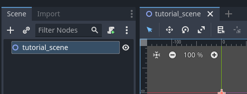
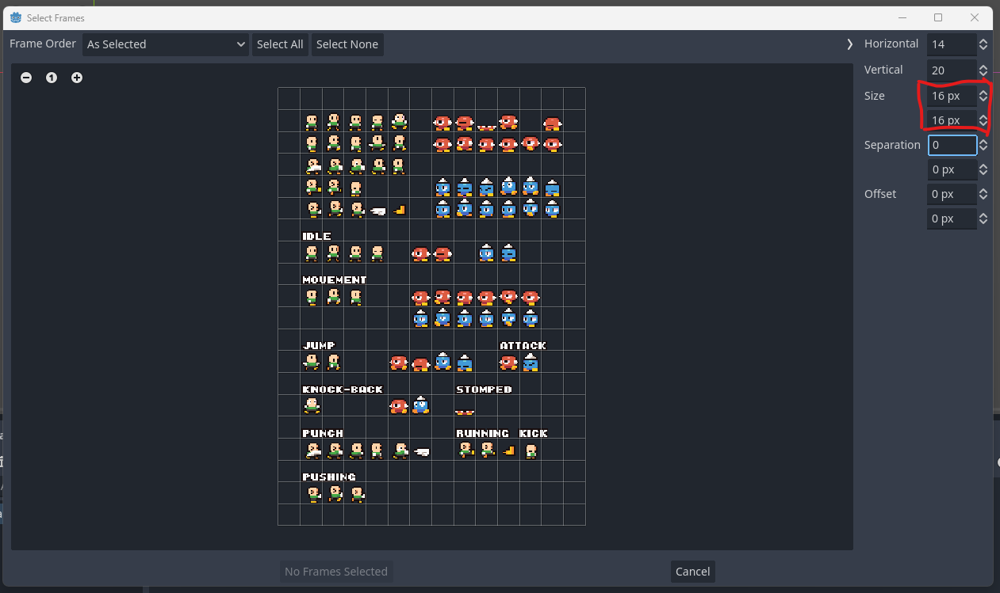
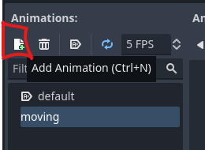
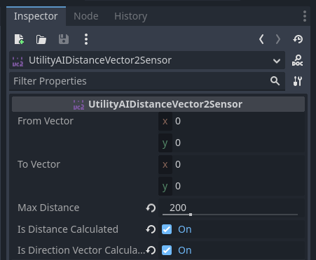

# Getting started with State Trees

In this beginner tutorial, you will learn how State Trees work and you will build a simple AI entity that reacts to some input. Once you have completed this tutorial, you will have understanding of the following: 

 * What a State Tree is
 * How a State Tree works
 * What *ticking the tree* means, and
 * How to construct a state tree using Utility AI GDExtension

For this tutorial, we'll start with an empty Godot 4.1  project. 

**Contents:**

 1. [Project creation and installation of Utility AI GDExtension](Getting_started_with_State_Trees.md#1-project-creation-and-installation-of-utility-ai-gdextension)
 2. [Setting up the project and assets](Getting_started_with_State_Trees.md#2-setting-up-the-project-and-assets)
 3. [About State Trees](Getting_started_with_State_Trees.md#3-about-state-trees)
 4. [Utility enabled State Trees in Utility AI GDExtension](Getting_started_with_State_Trees.md#4-utility-enabled-state-trees-in-utility-ai-gdextension)
 5. [Creating the scenes](Getting_started_with_State_Trees.md#5-creating-the-scenes)
 6. [Creating the State Tree for the AI-entity](Getting_started_with_State_Trees.md#6-creating-the-state-tree-for-the-ai-entity)
 7. [Adding the state handling methods](Getting_started_with_State_Trees.md#7-adding-the-state-handling-methods)
 8. [Running the main scene](Getting_started_with_State_Trees.md#8-running-the-main-scene)
 9. [Next steps](Getting_started_with_State_Trees.md#9-next-steps)


## 1. Project creation and installation of Utility AI GDExtension

Before we can begin, we need to create and setup the project, and add the assets we are going to use. To create a new Godot Engine project that uses Utility AI GDExtension, follow these steps: 


1. Open Godot Engine.


2. Click **New project**.


3. Then give the project a name and click the **Create folder** button.


4. Choose the renderer you want to use, and then click **Create & Edit**.


5. The Godot Engine Editor main scene will open up.


To install the Utility AI GDExtension addon, follow the [installation instructions](How_to_install_Utility_AI_GDExtension.md).

Once you have installed the extension, we are ready to set up the project and prepare the assets.


## 2. Setting up the project and assets

For this project we are going to use the assets used in the *example project*. Go to the [Releases](https://github.com/JarkkoPar/Utility_AI_GDExtension/releases) and download the latest version of the example project.


1. Open your Godot project and create a folder named **Assets** in the project root folder.


2. Open the example project folder you downloaded and copy the **"Standard sprites upd.png"** file to your own project, the Assets-folder.


You now have all the assets we need for this tutorial. The setup in your FileSystem tab should look like this:

<br>


## 3. About State Trees

State trees are a new solution to AI that combine the flexibility and tree-structure of Behaviour Trees to the state management of State Machines. The state tree defines a hierarchical set of states and allows you to define transitions to any level of the hierarchy. The state tree will then determine which child states are activated.


### 3.1 The structure of a State Tree

The structure of the state tree controls the state selection flow for your AI entity. A state tree consists of a **root node** that is the basis of the tree and the tree branches are created using **state nodes**. The state nodes can have zero or more child state nodes. If a state node does not have any child state nodes, it is considered to be a *leaf* node.

A state tree is updated by **ticking** the tree. When there are no states active, a **transition** is started with the **root** node as the transition target. This causes the states in the tree to be evaluated starting from the root node and descending down the tree until a leaf state node is found that can be activated. When a leaf node is found, all its parent nodes up until the root node will be marked as active nodes.

After the initial state has been chosen, the state transitions must be explicitly started by calling the `transition_to(new_state_nodepath:NodePath, user_data:Variant, delta:float)` method. The transition target can be any of the nodes in the tree, including the root node. The target is defined by the **NodePath relative to the root node of the state tree**. In the image below, if the `transition_to()` was called with the following parameters: `transition_to("/Child state 1/Sub child state 2", null, delta)`, it would cause the child states of *Sub child state 2* to be evaluated to find a new leaf state.

<br>
*A state tree with some states. The evaluation during transition is done in top-to-down order.*<br>

> [!NOTE]
> The node path *"."* means the root node, and causes the entire tree to be evaluated in a search for a new set of active states.


The hierarchy of active states is activated starting from the root node to the leaf node (i.e. going *down* the tree). When a set of states is no longer active, they are exited starting from the leaf node and going up towards the root node (i.e. going *up* the tree). When a transition occurs, only the states that are no longer active are deactivated, and only the states that were not previously active, get activated. 


### 3.2 The state handling methods of the state tree nodes

To handle state transitioning, entering, exiting and updating the states, four state handling methods can be defined for the state nodes: 

 * `func on_enter_condition(user_data, delta) -> bool` is used to check if the state can be entered. This method should **always** return either **true** or **false**. Alternatively the *utility-based considerations* can be used (see 4. Utility enabled State Trees in Utility AI GDExtension for more details). 
 * `func on_enter_state(user_data, delta)` is used to run any initialization the state needs to run before it is *ticked*.
 * `func on_exit_state(user_data, delta)` is used to run any clean up after the state is no longer active.
 * `func on_tick(user_data, delta)` is used to run what ever code the state needs to do when it is *ticked*.

The `transition_to()` method can be called anywhere in the state's script code. If you want to start a transition from the script of some completely different node, you should use a node reference to call the method, for instance `$MyStateTreeRoot.transition_to(".")`.

Any active state that is no longer active after the call to `transition_to()` will call its `on_exit_state()` method. Similarly, any inactive state that gets activated will call its `on_enter_state()` method. 

When the root node `tick()` method is called, all the active states will call their `on_tick()` methods, starting from the root node and going down the tree to the leaf node.


## 4. Utility enabled State Trees in Utility AI GDExtension

You can use the utility enabled State Trees as the sole AI reasoning component, or as a sub-component of the AI Agent Behaviours or Behaviour Trees. Utility-based considerations can be attached to all of the nodes in Utility AI GDExtension, including the State Tree nodes. The considerations can be attached either as child nodes or in the Inspector as a property.

For any of the **UtilityAISTNode** state nodes you can control how they will evaluate their child nodes during a `transition_to()` call. This is done by selecting the **Child State Selection Rule** in the **Inspector**.

<br>

If **OnEnterConditionMethod** is selected, the user-defined `on_enter_condition()` method will be called for the childs of the state node. If the method has not been defined, the evaluation will always return *true*.

If **UtilityScoring** is selected, the *considerations* attached to the child state nodes as either their child nodes or in the *Considerations* property will be evaluated and the highest-scoring state node will be selected. 


## 5. Creating the scenes

The state tree nodes work with both 2D and 3D scenes. For this tutorial we are creating everything in 2D because setting up the assets for 2D scenes is much quicker.

We will create two scenes: a **main scene** in which we will spawn our AI-entities in, and a **ai_entity** scene that is the AI-entity we will be creating.


### 5.1 Creating the scene bases and adding animation to the AI-entity


1. In your Godot Project, create a Node2D-based scene, name it as **tutorial_scene** and save it.

<br>

This will be our *main scene* and we will *instantiate* the AI entities in to this scene.  The AI entity itself will be a separate AnimatedSprite2D scene with a state tree.


2. Create a new AnimatedSprite2D-based scene and name it as **ai_entity**.

<br>


3. In the **ai_entity** scene, select the ai_entity AnimatedSprite2D in the **Scene-tab** and then in the **Inspector-tab** expand the **Animation** group.

<br>


4. In the popup menu, choose **New SpriteFrames**. This will create a new SpriteFrames resource for the AnimatedSprite2D.

<br>


5. Click the created SpriteFrames again to select it. This will open up the **SpriteFrames menu** at the bottom of the Godot Editor. The next steps will take place in that menu.

<br>


6. Make sure the "default" animation is selected, then click on the "Add frames from sprite sheet" icon.

<br>


7. Open file dialog will open up. Go to the Assets-folder and select the file **Standard sprites upd.png**, then click **Open**.

<br>


8. The **Select frames** will open up. On the right-side of the dialog, change the **Size** to 16px in width and 16px in height. The grid should then match the sprites on the spritesheet.

<br>


9. The **default** animation will be the idle-pose for the **ai_entity**. Choose which ever creature you want from the sprite sheet and select its idle animation frames, then click the **Add X Frame(s)** button (X will be the number of frames you've selected.

<br>


10. In the **SpriteFrames menu**, make sure that the **Autoplay on Load** has been selected for the **default** animation.

<br>


11. Create a new animation by clicking the **Add animation** button and set its name as **moving**. Then add movement frames similarly as we did for the *default* animation in the prior steps.

<br>


12. If you haven't saved your project yet after adding the new scenes, do it now.


### 5.2 Adding spawning to the main scene


1. Go to the **tutorial_scene** tab in the editor. In the **scene-tab** make sure the **tutorial_scene** Node2D is selected and then click the **Attach a new or existing script to the selected node** button.

<br>
 


2. In the **Attach Node Script** dialog, you can leave everything to defaults and click the **Create** button.

<br>


3. The **Script editor** should be automatically shown. If not, choose it from the menu at the top of the editor view. You should see the following code:

```gdscript
extends Node2D


# Called when the node enters the scene tree for the first time.
func _ready():
	pass # Replace with function body.


# Called every frame. 'delta' is the elapsed time since the previous frame.
func _process(delta):
	pass

```

This is the default code given if you kept the default settins when creating the script. Replace the code with the following (see explanation for it below):

```gdscript
extends Node2D

@onready var ai_entity_template:PackedScene = preload("res://ai_entity.tscn")
var mouse_position:Vector2


# Called when the node enters the scene tree for the first time.
func _ready():
	randomize()
	# For convinience in changing the number of AI-entities to create
	var num_entities:int = 1
	
	# Create all the entities.
	for i in range(0, num_entities):
		# Instantiates an AI-entity.
		var new_ai_entity:Node2D = ai_entity_template.instantiate()
		# Sets a random position somewhere on the screen for the AI-entity.
		new_ai_entity.position = Vector2( randf() * get_viewport_rect().end.x, randf() * get_viewport_rect().end.y)
		# Adds the AI-entity to the scene.
		add_child(new_ai_entity)


func _physics_process(delta):
	# Set the mouse cursor position as the to-vector.
	mouse_position = get_viewport().get_mouse_position()


```

This code will instantiate the given number of AI-entities to the main scene to random positions. 

 * On the row The `@onready var ai_entity_template:PackedScene = preload("res://ai_entity.tscn)` we load the **ai_entity** scene which we will use to instantiate the AI entities in the **_ready()** method.
 * After that we create a variable **mouse_position** that the AI entities will use to check where the mouse cursor is.
 * In the **_ready()** method we first set the number of entities to instantiate as 1 in `var num_entities:int = 1`. Then in the **for-loop** we first use the `instantiate()` method of the loaded *ai_entity* scene to create a new instance of the AI entity, we then set a random position for it, and finally add it to the *main scene* by adding it as a child using the `add_child(new_ai_entity)` method. 
 * In the **_physics_process(delta)** method the only thing we do is set the `mouse_position` variable as the current position. We do this once in the main scene, as finding the mouse position is a surprisingly costly operation and calling this method for each AI entity can get quite costly when you add more of them.

We are now done with the main scene. Next we will focus on creating the **ai_entity** scene with a State Tree based AI.


## 6. Creating the State Tree for the AI entity


1. Select the **ai_entity** scene in the editor.


2. In the **scene-tab**, right-click on the **ai_entity AnimatedSprite2D** node and choose **Add Child Node**.

<br>


3. Choose the **UtilityAISTRoot** node and add it to the scene by clicking the **Create** button. The root-node will be the node we will be *ticking* later in code.

<br>


4. We'll use a **Sensor** to track the distance and direction vector to the mouse cursor. Right-click on the **UtilityAISTRoot** node you created and add a **UtilityAIDistanceVector2Sensor** as its child node. 

<br>

In the **Inspector** make sure to check the boxes for **Is Distance Calculated** and **Is Direction Vector Calculated** for the distance sensor. These are set to **false** (unchecked) by default as the sensor uses the *squared distance* internally and unless they are set to **true** (checked), the direction vector and the distance will not be calculated. Then update the **Max Distance** property to **200**. 

<br>


5. Add another child node to the UtilityAISTRoot node, this time a **UtilityAISTNode**. This will be one of the states the AI entity will have. 

<br>


6. Rename the UtilityAISTNode as **Moving**. 

<br>


7. Add two UtilityAISTNodes under the **Moving** node and name them as **Moving away** and **Moving closer**. 

<br>


8. Add one more UtilityAISTNode under the **UtilityAISTRoot** node and name it as **Waiting**. 

<br>


We have now created a simple state structure for the AI's logic. What is missing are ai_entity related code and the state handling methods `on_enter_condition()` `on_enter_state()`, `on_exit_state()` and `on_tick()` for all of the states. We will add them in the next step.


## 7. Adding the state handling methods


1. In the **ai_entity** scene, in the **Scene-tab**, attach a script to the **ai_entity** node. Replace the code with the following code (see explanation for it below):

```gdscript
extends AnimatedSprite2D

# This is the distance sensor. 
@onready var sensor_distance:UtilityAIDistanceVector2Sensor = $UtilityAISTRoot/UtilityAIDistanceVector2Sensor
var movement_speed:float = 0.0


func _physics_process(delta):
	# Set the AI-entity position as the from-vector.
	sensor_distance.from_vector = global_position
	
	# Set the mouse cursor position as the to-vector.
	sensor_distance.to_vector = get_parent().mouse_position 
	
	# Update the AI.
	$UtilityAISTRoot.tick(self, delta)
	
	# Move based on movement speed.
	self.global_position += sensor_distance.direction_vector * movement_speed * delta
	
	# Flip the sprite horizontally based on the direction vector horizontal (x)
	# value.
	flip_h = (sensor_distance.direction_vector.x < 0)
	# If the movement speed is negative, the entity is moving away so
	# we should flip the sprite again.
	if movement_speed < 0.0:
		flip_h = !flip_h


```

What this code does:
 * The row `@onready var sensor_distance:UtilityAIDistanceVector2Sensor = $UtilityAISTRoot/UtilityAIDistanceVector2Sensor` gets a reference to the Vector2 based distance sensor of the AI entity. This sensor is used to check the distance and to get the direction vector towards the target.
 * The row `var movement_speed:float = 0.0` defines a variable that we will use to control the movement speed of the AI entity.
 * In the `_physics_process(delta)` method we first set the distance sensor **from-position** as the global position of the AI entity, and the **to-position** as the location of the mouse cursor from the parent node. The sensor will use these two positions to calculate the distance from the AI entity to the mouse cursor, and also the direction vector that we will use later for movement.
 * `$UtilityAISTRoot.tick(self, delta)` ticks the state tree. As **user_data** we give the root node of the AI entity scene which in this case is the **self** keyword. This gives the state tree node state handling methods access to all the properties of the AI entity node.
 * After *ticking* the root node, the row `self.global_position += sensor_distance.direction_vector * movement_speed * delta` moves the AI entity based on the direction vector calculated by the distance sensor. Delta time is used to scale the movement amount. The `movement_speed` is set by the active state.
 * The final rows of the method make sure the character sprite is facing the direction it is moving to by flipping the sprite horizontally when needed.


2. In the **ai_entity** scene, in the **Scene-tab**, attach a script to the **Moving closer** node. Replace the code with the following code (see explanation for it below):

```gdscript
extends UtilityAISTNode


func on_enter_condition(actor, delta):
	return actor.sensor_distance.distance > 200.0


func on_enter_state(actor, delta):
	actor.movement_speed = -100
	actor.play("moving")


func on_exit_state(actor, delta):
	pass


func on_tick(actor, delta):
	if actor.sensor_distance.distance <= 200:
		transition_to(".", actor, delta)

```

For all the methods we name the **user_data** parameter as the **actor**. You can set the name to anything you want. In this case the name "actor" was chosen because in step 7.1 we use the **ai_entity** node in the root node `tick()` method.

The **on_enter_condition()** method is used to determine if the state should be entered. It is executed when the `transition_to()` method is called and the state tree is evaluated. The *Moving closer* state is entered if the distance between the AI entity and the mouse cursor is more than 200 pixels. 

The **on_enter_state()** method is called when this state is entered. For the *Moving closer* state we set the movement speed and animation for the actor.

The **on_exit_state()** method is called when the state is exited. For this tutorial we don't need to do any clean up and the content is left empty. In a real game you would simply not define this method when you do not need it. It is included here to make you aware of it.

The **on_tick()** method is called every time the state tree is ticked. This is where you usually add code to update the AI entity's properties related to state updates and also the conditions for transitioning away from this state using the `transition_to()` method. In this case, if the distance is less or equal to 200 pixels the `transition_to()` method is called with parameters `new_state_nodepath="."` and the actor and delta. The *"."* node path will evaluate the states to transition to starting from the **UtilityAISTRoot** node.


3. In the **ai_entity** scene, in the **Scene-tab**, attach a script to the **Moving away** node. Replace the code with the following code (see explanation for it below):

```gdscript
extends UtilityAISTNode


func on_enter_condition(actor, delta):
	return actor.sensor_distance.distance < 90.0


func on_enter_state(actor, delta):
	actor.movement_speed = 100
	actor.play("moving")


func on_exit_state(actor, delta):
	pass


func on_tick(actor, delta):
	if actor.sensor_distance.distance >= 90 :
		transition_to(".", actor, delta)


```

Again, we define the state handling methods. This time the **on_enter_condition()** method checks if the AI entity is too close, and the **on_enter_state()** sets the movement speed to 100, which is the opposite direction to what we set for the *Moving closer* state.


4. In the **ai_entity** scene, in the **Scene-tab**, attach a script to the **Waiting** node. Replace the code with the following code (see explanation for it below):

```gdscript
extends UtilityAISTNode


func on_enter_state(actor, delta):
	actor.movement_speed = 0
	actor.play("default")


func on_exit_state(actor, delta):
	pass


func on_tick(actor, delta):
	if actor.sensor_distance.distance > 200 or actor.sensor_distance.distance < 90:
		transition_to("Moving", actor, delta)


```

For the **Waiting** node we do not have the **on_enter_condition()** method at all. This means that it will **always return true**. This is convinient for creating *fallback states* after other state options. The **on_enter_state()** method sets the movement speed to 0 and the animation as *"default"*.

The **on_tick()** method does only a distance check and if the distance isn't within the bounds, it calls the `transition_to()` method to move to the **Moving** state. This will cause the state tree to evaluate both the *Moving closer* and *Moving away* states.


5. Your **ai_entity** scene should now look like the image below, with scripts added to the **ai_entity**, **Moving closer**, **Moving away** and **Waiting** nodes. 

<br>


## 8. Running the main scene

Now that we've added the logic for the AI in the form of a state tree and the needed state handling methods, you can select the **tutorial_scene** and run it. As you move the mouse cursor, the AI entity should move closer to the cursor if it is too far away and farther away if the cursor gets too close. 

To change the number of AI entities created, change the `num_entities` variable to a larger value in the **tutorial_scene**.


## 9. Next steps

This concludes the tutorial, but there are things you can try to learn more. For instance:

 * Try adding some more logic to the tutorial scene, for instance a point that the AI entities want to avoid, an animation they will some times play when they are not moving or an item they can pick up.
 * Try adding another type of AI entity that has some other logic for its behaviour. 
 * Try setting the the `num_entities` to a larger value in the **tutorial_scene**. How many AI entities you can add without it affecting performance? 

In this tutorial the State Tree is ticked every physics frame, and this is how state machines are usually used in games. States are a very convinient way of organizing your game and AI logic. After the State Tree has chosen the active states, the ticking only has the cost of the logic that you've built within the `on_tick()` method. 

The tutorial State Tree was created so that it sets some parameters for the AI entity when entering a state, namely which animation it should play and its movement speed, and then during each *tick* it checks if a transition should occur. The ticking is therefore focused on checking if transitions between states are needed. You can also use the state tree the other way around: you have the game logic *inside* the states within the `on_tick()` method and then use **events** to check when a state transition should occur. 

The game world usually doesn't change dramatically between frames, so it can be said that the tutorial State Tree does a lot of redundant checking for transitions by checking them every frame. This can be fixed simply by adding a delay or a cooldown as mentioned in the Behaviour Tree tutorial. Each time you tick the tree, you set a variable in the **ai_entity** node to some short time duration and then tick the tree only after this time has passed. An example of this is given below.

However, it is common to tick the state machines every frame so don't be afraid to do so. It all depends on how you are using the State Tree. 

To see the difference of adding some delay to ticking the tree, test how the code below for the **ai_entity** script changes the way the AI works. The only thing it adds is the `ticking_delay` variable that introduces a minimum delay plus a random variance to when the ticking occurs. You can try adding different delays and how it affects performance, the AI reaction times and the number of entities you can run.

```gdscript
extends AnimatedSprite2D

# This is the distance sensor. 
@onready var sensor_distance:UtilityAIDistanceVector2Sensor = $UtilityAISTRoot/UtilityAIDistanceVector2Sensor
var movement_speed:float = 0.0
var ticking_delay:float = 0.0


func _ready():
	ticking_delay = randf() * 0.3


func _physics_process(delta):
	# Set the AI-entity position as the from-vector.
	sensor_distance.from_vector = global_position
	
	# Set the mouse cursor position as the to-vector.
	sensor_distance.to_vector = get_parent().mouse_position 
	
	# Update the AI.
	ticking_delay -= delta
	if ticking_delay <= 0.0:
		ticking_delay = 0.3 + randf() * 0.3
		$UtilityAISTRoot.tick(self, delta)
	
	# Move based on movement speed.
	self.global_position += sensor_distance.direction_vector * movement_speed * delta
	
	# Flip the sprite horizontally based on the direction vector horizontal (x)
	# value.
	flip_h = (sensor_distance.direction_vector.x < 0)
	# If the movement speed is negative, the entity is moving away so
	# we should flip the sprite again.
	if movement_speed < 0.0:
		flip_h = !flip_h

```
