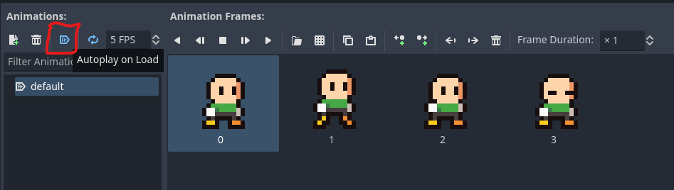
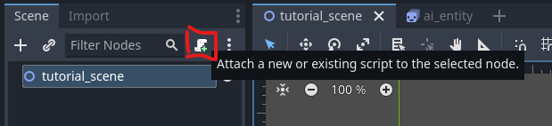

# Getting started with the Node Query System (NQS)

In this beginner tutorial, you will learn how the Node Query System works and you will build a simple AI entity that reacts to some input. Once you have completed this tutorial, you will have understanding of the following: 

 * What the Node Query System is
 * How Search Spaces work
 * How to run the queries, and
 * How to construct node queries using Utility AI GDExtension

For this tutorial, we'll start with an empty Godot 4.1  project. 

**Contents:**

 1. [Project creation and installation of Utility AI GDExtension](Getting_started_with_the_Node_Query_System.md#1-project-creation-and-installation-of-utility-ai-gdextension)
 2. [Setting up the project and assets](Getting_started_with_the_Node_Query_System.md#2-setting-up-the-project-and-assets)
 3. [About the Node Query System](Getting_started_with_the_Node_Query_System.md#3-about-behaviour-trees)
 4. [Utility enabled Behaviour Trees in Utility AI GDExtension](Getting_started_with_the_Node_Query_System.md#4-utility-enabled-behaviour-trees-in-utility-ai-gdextension)
 5. [Creating the scenes](Getting_started_with_the_Node_Query_System.md#5-creating-the-scenes)
 6. [Creating the Behaviour Tree for the AI-entity](Getting_started_with_the_Node_Query_System.md#6-creating-the-behaviour-tree-for-the-ai-entity)
 7. [Adding the on_tick() methods](Getting_started_with_the_Node_Query_System.md#7-adding-the-on_tick-methods)
 8. [Running the main scene](Getting_started_with_the_Node_Query_System.md#8-running-the-main-scene)
 9. [Next steps](Getting_started_with_the_Node_Query_System.md#9-next-steps)


## 1. Project creation and installation of Utility AI GDExtension

Before we can begin, we need to create and setup the project, and add the assets we are going to use. To create a new Godot Engine project that uses Utility AI GDExtension, follow these steps: 


1. Open Godot Engine.


2. Click **New project**.


3. Then give the project a name and click the **Create folder** button.


4. Choose the renderer you want to use, and then click **Create & Edit**.


5. The Godot Engine Editor main scene will open up.


To install the Utility AI GDExtension addon, follow the [installation instructions](How_to_install_Utility_AI_GDExtension.md).

Once you have installed the extension, we are ready to set up the project and prepare the assets.


## 2. Setting up the project and assets

For this project we are going to use the assets used in the *example project*. Go to the [Releases](https://github.com/JarkkoPar/Utility_AI_GDExtension/releases) and download the latest version of the example project.

1. Open your Godot project and create a folder named **Assets** in the project root folder.

2. Open the example project folder you downloaded and copy the **"Standard sprites upd.png"** file to your own project, the Assets-folder.


You now have all the assets we need for this tutorial. The setup in your FileSystem tab should look like this:

<br>


## 3. About the Node Query System

In many games the AI must do **searches** in the game world to find things like *the best position to shoot from*, *the best item to use* or *the best tile to move to*, and so on. Behaviour Trees, State Machines and other systems used for reasoning don't usually cater for this need. One of the solutions is a **utility based querying system**.

The Node Query System in Utility AI GDExtension aims to be a *generalized* querying system for all types of nodes in the Godot Engine. Somewhat similar systems in other engines are the *Environment Query System* in *Unreal Engine* and the *Spatial Query System* in *CryEngine*. Many of the queries in games do focus on finding locations in 3D or 2D worlds and NQS in Utility AI GDExtension can do these types of searches. It can do more, however, and search and rank any type of node in a scene.


### 3.1 The structure of query

The queries in NQS are created by combining **search spaces** and **search criteria**. 

The **search spaces** define a set of nodes that will be used as the target nodes during a search. These can be *nodes that belong to a certain group*, *nodes that are child nodes of a certain node* or *generated point grids*, for example. Various properties can be set for the search spaces to guide the search, such as how many nodes should be returned.

The **search criteria** define how the search space nodes are **scored** and **filtered** to find the **top N** nodes that fit the given criteria. They are placed as **child nodes** of the search space nodes. The prioritization of the search criteria is the order in which they are placed as the childs of a search space: the top-most node has the highest priority, the ones below it lower. It makes usually sense to put **filtering** criteria as the top-most criteria nodes in the order of how effectively they filter out the nodes, and after those any nodes that **only are used for scoring**.


### 3.2 Posting queries and retrieving their results

The queries are posted using the `NodeQuerySystem` singleton's `post_query(search_space, is_high_priority)` method. The first parameter is a reference to the **search space node** and the second a boolean that defines if the query is high priority or not. The query system uses **time budgeting**, also commonly called *time slicing*. High priority queries get more time per physics frame for their execution than regular, non-high priority queries.

When a query is posted it is added to a list of active queries. Queries in the active list are executed in a *round-robin* manner. This means that the queries are run in a *loop* starting from the first posted query going towards the latest posted query, and looping back to the first, until the queries have completed or the time to run queries for the physics frame has run out. A high priority query gets to run up to 20 microseconds per update, and a regular priority query up to 10 microseconds. 


### 3.3 Challenges with game world queries

Queries take time. Especially queries that need to go through large data sets and do complex logic to filter and score the results can be time consuming. If a game targets 120 or 60 FPS refresh rates, there isn't much time to run the queries per frame in addition to all the other game logic. This means that the queries will have only a fraction of the frame time available for the searches they need to perform. 

To enable queries and good overall game performance, per frame **time budgeting** or *time slicing* needs to be used. With time budgeting the queries can run a set amount of time per frame, and then suspend until the next frame. This causes a delay between when a query was posted and when the results are returned. 

Luckily AI can do something other systems cannot: **AI can wait**. 


## 4. Waiting is a super power

It may sound peculiar, but unlike other systems in a game, AI can usually wait. As long as the AI entity has something reasonably intelligent-looking to do, the players won't notice that the AI is actually waiting for a query or any other background task to finish. The key is to find a sweet spot where the frame time is reasonable and the waiting time is not too much to be distracting to the players. This means optimizing the *search space*, the *search criteria* and *when the queries are posted*. Queries can also be *prioritized* so that important ones get a high priority and more execution time per frame.

In this tutorial we will create an extreme example to illustrate the functionality of the NQS and time budgeting in a similar setting to the other AI components available in Utility AI GDExtension. Unlike in a real game, *all* the AI does in this tutorial is continuously run queries to do its logic. By default the search space is 90 node point grid with little criterias to minimize it. To make matters worse, the AI entities will even post all their queries at the same time when starting the scene. As you increase the number of AI entities you will likely see some delay starting to happen when a few hundred to a thousand AI entities have been added (depending on your hardware, of course). As such, this tutorial scene is also a good way to get a feel on how much waiting is too much waiting.

In a real game, you will likely have less AI entities running queries, they will run the queries at different times and your search spaces will be more optimized.


## 5. Creating the scenes

The Node Query System works with both 2D and 3D scenes. For this tutorial we are creating everything in 2D because setting up the assets for 2D scenes is much quicker.

We will create two scenes: a **main scene** in which we will spawn our AI-entities in, and a **ai_entity** scene that is the AI-entity we will be creating.

### 5.1 Creating the scene bases and adding animation to the AI-entity

1. In your Godot Project, create a Node2D-based scene, name it as **tutorial_scene** and save it.

<br>

This will be our *main scene* and we will *instantiate* the AI entities in to this scene.  The AI entity itself will be a separate AnimatedSprite2D scene that will be steered by a NQS query.


2. Create a new AnimatedSprite2D-based scene and name it as **ai_entity**.

<br>


3. In the **ai_entity** scene, select the ai_entity AnimatedSprite2D in the **Scene-tab** and then in the **Inspector-tab** expand the **Animation** group.

<br>


4. In the popup menu, choose **New SpriteFrames**. This will create a new SpriteFrames resource for the AnimatedSprite2D.

<br>


5. Click the created SpriteFrames again to select it. This will open up the **SpriteFrames menu** at the bottom of the Godot Editor. The next steps will take place in that menu.

<br>


6. Make sure the "default" animation is selected, then click on the "Add frames from sprite sheet" icon.

<br>

7. Open file dialog will open up. Go to the Assets-folder and select the file **Standard sprites upd.png**, then click **Open**.

<br>


8. The **Select frames** will open up. On the right-side of the dialog, change the **Size** to 16px in width and 16px in height. The grid should then match the sprites on the spritesheet.

<br>


9. The **default** animation will be the idle-pose for the **ai_entity**. Choose which ever creature you want from the sprite sheet and select its idle animation frames, then click the **Add X Frame(s)** button (X will be the number of frames you've selected.

<br>


10. In the **SpriteFrames menu**, make sure that the **Autoplay on Load** has been selected for the **default** animation.

<br>


11. Create a new animation by clicking the **Add animation** button and set its name as **moving**. Then add movement frames similarly as we did for the *default* animation in the prior steps.

<br>


12. If you haven't saved your project yet after adding the new scenes, do it now.


### 5.2 Adding a point grid and spawning to the main scene

1. Go to the **tutorial_scene** tab in the editor. Right click on the **tutorial_scene** node and add a **UtilityAIPointGrid2DSearcSpace** node. We use this search space only to create a shared point grid for all the AI entities.

<br>


2. Add another child node to the **tutorial_scene** node, this time a **Node2D** and change its name to **mouse_point_grid**.

<br>


3. In the **Scene-tab**, select again the **UtilityAIPointGrid2DSearchSpace** node and go to the **Inspector-tab**. Set the *mouse_point_grid* as the **Point Grid Parent Node**, change the **Grid Size** to x=400, y=400, the **Point Grid Lattice Type** to **Custom**, and edit the **Point Grid Base Spacing Vector** to x=96, y=48 and the **Point Grid Lattice Vector** to x=48 and y=24.  

<br>


4. To see the grid, we will add a **DEBUG** node as a child of the **UtilityAIPointGrid2DSearchSpace**. Right click on the search space node and then add a **Sprite2D** node as its child. Rename the *Sprite2D* node as **DEBUG**.

<br>

5. Make sure the *DEBUG* node is selected, then in the **Inspector-tab** set the texture as the Godot icon and change the scale to 0.1.

<br>

6. The *DEBUG* node still selected, go to the **Node-tab**, click the Groups selection and add the DEBUG node in to the **point_grid** group.

<br>


6. Your node tree in the **Scene-tab** should look now as follows:

<br>

7. In the **Scene-tab** select the **tutorial_scene** and then click the **Attach a new or existing script to the selected node** button.

<br>
 

8. In the **Attach Node Script** dialog, you can leave everything to defaults and click the **Create** button.

<br>


9. The **Script editor** should be automatically shown. If not, choose it from the menu at the top of the editor view. You should see the following code:

```gdscript
extends Node2D


# Called when the node enters the scene tree for the first time.
func _ready():
	pass # Replace with function body.


# Called every frame. 'delta' is the elapsed time since the previous frame.
func _process(delta):
	pass

```

This is the default code given if you kept the default settins when creating the script. Replace the code with the following (see explanation for it below):

```gdscript
extends Node2D

@onready var ai_entity_template:PackedScene = preload("res://ai_entity.tscn")
var mouse_position:Vector2


# Called when the node enters the scene tree for the first time.
func _ready():
	
	# To see how the NQS is running, we initialize the performance counters.
	NodeQuerySystem.initialize_performance_counters()
	# We won't be using regular queries, so allocate 100% of the time budget to 
	# the high priority queries.
	NodeQuerySystem.set_time_allocation_pct_to_high_priority_queries(1.0)
	
	# For convinience in changing the number of AI-entities to create
	var num_entities:int = 256
	
	# Create all the entities.
	for i in range(0, num_entities):
		# Instantiates an AI-entity.
		var new_ai_entity:Node2D = ai_entity_template.instantiate()
		# Sets a random position somewhere on the screen for the AI-entity.
		new_ai_entity.position = Vector2( randf() * get_viewport_rect().end.x, randf() * get_viewport_rect().end.y)
		
		# Adds the AI-entity to the scene.
		add_child(new_ai_entity)


func _physics_process(delta):
	# This will run the node queries that have been posted by the ai entities.
	NodeQuerySystem.run_queries()

	# Set the mouse cursor position as the to-vector.
	mouse_position = get_viewport().get_mouse_position()
	
	# Move the point grid to the mouse position.
	$mouse_point_grid.position = mouse_position

```

This code will instantiate the given number of AI-entities to the main scene to random positions. 

 * On the row The `@onready var ai_entity_template:PackedScene = preload("res://ai_entity.tscn)` we load the **ai_entity** scene which we will use to instantiate the AI entities in the **_ready()** method.
 * After that we create a variable **mouse_position** that the AI entities will use to check where the mouse cursor is.
 * In the **_ready()** method we first initialize the Node Query System performance counters by calling `NodeQuerySystem.initialize_performance_counters()`. This isn't necessary, but allows us to see how the queries are doing in the Debugging-menu when running the scene.
 * We then set the **time allocation percent** to allocate 100% of the time budget to high priority queries by calling the `NodeQuerySystem.set_time_allocation_pct_to_high_priority_queries(1.0)`. 
 * After that we set the number of entities to instantiate as 256 in `var num_entities:int = 256`. 
 * Then in the **for-loop** we first use the `instantiate()` method of the loaded *ai_entity* scene to create a new instance of the AI entity, we then set a random position for it, and finally add it to the *main scene* by adding it as a child using the `add_child(new_ai_entity)` method. 
 * In the **_physics_process(delta)** method we run all the NQS queries by calling `NodeQuerySystem.run_queries()` method. **Remember**: this only should be done once per frame in the main scene. We then set the `mouse_position` variable as the current position. We do this once in the main scene, as finding the mouse position is a surprisingly costly operation and calling this method for each AI entity can get quite costly when you add more AI entities. And finally, we move the point grid to the mouse position by updating the position of the **mouse_point_grid** node.

We are now done with the main scene. Next we will focus on creating the **ai_entity** scene and create a NQS query for it that will utilize the point grid we created. We will use a Behaviour Tree root node to post the query.


## 6. Creating the the AI entity scene


1. Select the **ai_entity** scene in the editor.


2. In the **scene-tab**, right-click on the **ai_entity AnimatedSprite2D** node and choose **Add Child Node**.

<br>

3. Choose the **UtilityAINodeGroupSearchSpace** and add it to the scene by clicking the **Create** button. 

<br>

4. With the **UtilityAINodeGroupSearchSpace** selected, go to the **Inspector-tab** and write in the **Group Name** property the same group name you added for the *DEBUG* node: **point_grid**. This will make the search space use the grid point nodes as its search space.

5. We'll now add the **search criteria** as the child nodes of the *search space*. The first one will be used to filter out the nodes so that they form the familiar donut-shape from the other tutorials. Add a child node to the search space and choose the **UtilityAIDistanceToVector2SearchCriterion** node. 

<br>

6. Select the **UtilityAIDistanceToVector2SearchCriterion** node in the **Scene-tab**, then in the **Inspector-tab** set the **Min Distance** property to **90** and the **Max Distance** property to **200**. Make sure both **Use for Scoring** and **Use for Filtering** properties are checked.

<br>

7. The second search criteria will be used to find the closest grid point to the AI entity. Create a **UtilityAIDistanceToNode2DSearchCriterion** as a child of the **UtilityAINodeGroupSearchSpace**.

<br>

8. Select the **UtilityAIDistanceToNode2DSearchCriterion** node and then set the **Distance To** property as the **ai_entity** node, the **Max Distance** property to 1000. Finally, add an **activation curve** that goes from 1.0 to 0.0 in the Y-axis as X-axis increases to 1. This will make the nodes that are *near* to the AI entity get a high score and those that are farther away a lower score.

<br>

**We are now done with the NQS query. Next we'll add the Behaviour Tree nodes that will continuously run the query.**

9. Add a **UtilityAIBTRoot** node as the child of the **ai_entity** node, and then add a **UtilityAIBTRunNQSQuery** node as the child of the **UtilityAIBTRoot** node.

<br>

10. With the **UtilityAIBTRunNQSQuery** node selected, go to the **Inspector-tab** and set the **Nqs Search Space** property as the **UtilityAINodeGroupSearchSpace** node.

<br>


We have now created the structure for the NQS query. On each tick the AI entity will try to post the query. This will only succeed if the query has completed.


## 7. Adding the ai_entity script


1. In the **ai_entity** scene, in the **Scene-tab**, attach a script to the **ai_entity** node. Replace the code with the following code (see explanation for it below):

```gdscript
extends AnimatedSprite2D

var movement_speed:float = 100.0
var movement_target_point:Vector2
var dir_to_target:Vector2


func _physics_process(delta):
	# Set the AI-entity position as the from-vector.
	$UtilityAINodeGroupSearchSpace/UtilityAIDistanceToVector2SearchCriterion.distance_to_vector = get_parent().mouse_position 
	
	# Update the AI.
	$UtilityAIBTRoot.tick(self, delta)
	
	# Move based on movement speed.
	self.global_position += dir_to_target * movement_speed * delta
	if (global_position - movement_target_point).length() < 10.0:
		movement_speed = 0.0
	else:
		movement_speed = 100.0
	
	# Flip the sprite horizontally based on the direction vector horizontal (x)
	# value.
	flip_h = (dir_to_target.x < 0)
	# If the movement speed is negative, the entity is moving away so
	# we should flip the sprite again.
	if movement_speed < 0.0:
		flip_h = !flip_h

```

What this code does:
 * The row `var movement_speed:float = 0.0` defines a variable that we will use to control the movement speed of the AI entity. We also define two other variables: `movement_target_point` that is the target the AI entity will move to, and the `dir_to_target` that will be used to store the direction towards the movement target point for the AI entity.
 * In the `_physics_process(delta)` method we first set the **UtilityAIDistanceToVector2SearchCriterion**'s **distance_to_vector** property as the location of the mouse cursor from the parent node. This will create the donut-shape for the query result.
 * `$UtilityAIBTRoot.tick(self, delta)` ticks the behaviour tree. As **user_data** we simply give **null**, as we do not need it for this tutorial.
 * After *ticking* the root node, the row `self.global_position += dir_to_target * movement_speed * delta` moves the AI entity based on the direction vector we will soon calculate in a method we will define soon. We will also set the `movement_speed` in that method. Delta time is used to scale the movement amount.
 * The following `if (global_position - movement_target_point).length() < 10.0:` statement checks if the AI entity is close enough to its target and then sets the `movement_speed` to **0.0**, which stops the AI entity. Otherwise it sets the movement speed to **100**.
 * The final rows of the method make sure the character sprite is facing the direction it is moving to by flipping the sprite horizontally when needed.

> [!NOTE]
> For this tutorial we are calling the root node `tick()` method every physics frame. This isn't what you usually want to do in a real game. See section [9. Next steps](Getting_started_with_the_Node_Query_System.md#9-next-steps) for more information.


2. In the **Scene-tab**, select the **UtilityAINodeGroupSearchSpace** and then go to the **Node-tab** and connect the **query_completed(search_space: Object)** signal to the **ai_entity** scene's script.

3. Set the signal handler code as follows (explanation of the code follows):

```gdscript

func _on_utility_ai_node_group_search_space_query_completed(search_space):
	if search_space.query_results.size() == 0:
		return
	movement_target_point = search_space.query_results[0].global_position
	dir_to_target = (movement_target_point - global_position).normalized()


```

This code is called when ever the NQS query completes. It first checks if the query returned any results. Then it assings the `movement_target_point` as the global position of the first point grid node found by the query. Finally, it calculates the *direction vector* towards the target point from the AI entity's position in the final row `dir_to_target = (movement_target_point - global_position).normalized()`.

The AI entity scene is now completed. It is time to run the **tutorial_scene** and see the results.


## 8. Running the main scene

Now that we've added the logic for the AI in the form of the NQS query and the required code to post the queries, you can select the **tutorial_scene** and run it. As you move the mouse cursor, the AI entity should move to the points in the point grid. 

To change the number of AI entities created, change the `num_entities` variable to a larger value in the **tutorial_scene**. 


## 9. Next steps

This concludes the tutorial, but there are things you can try to learn more. For instance:

 * Try setting the the `num_entities` to a larger value in the **tutorial_scene**. How many AI entities you can add without it affecting performance? How does it affect the movement of the AI entities?
 * Try adding some more *features* to the point grid by attaching a script to the *DEBUG* node, and then criteria to the AI-entity's NQS query to score and filter the results.
 * Try resizing or changing the spacing of the point grid and the lattice vector to create different grid shapes. How does changing the values affect the results? 

You may notice that adding more AI entities creates more delay before they start moving when running the tutorial scene. This is because of the per physics frame **time budgeting** for the queries. All the queries advance a little bit each frame, and when the number of queries becomes larger, only some of them have time to advance. This creates the delay. This delay can be mitigated by adjusting the time budget, adding smarter filtering criteria, or by adjusting search space nodes (which in this case is the point grid). 

