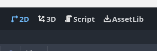
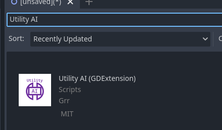
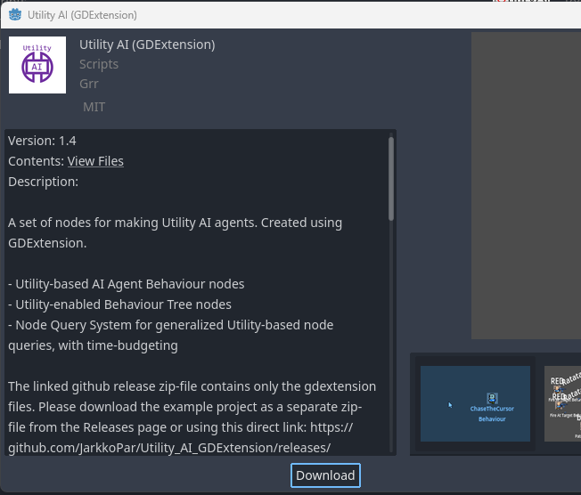
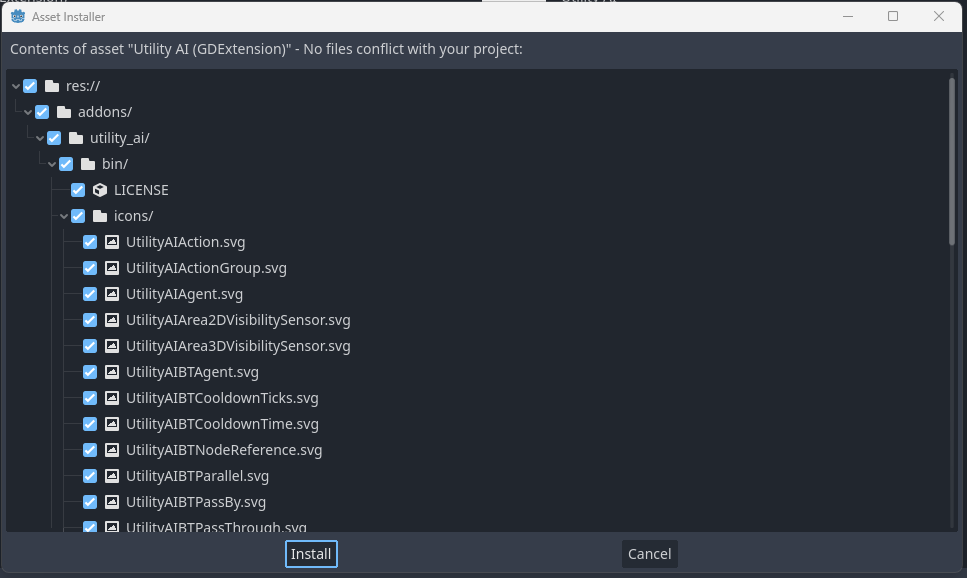
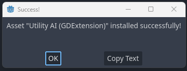
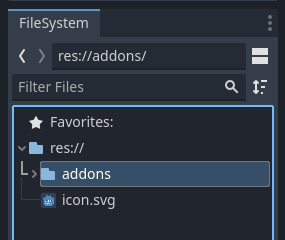
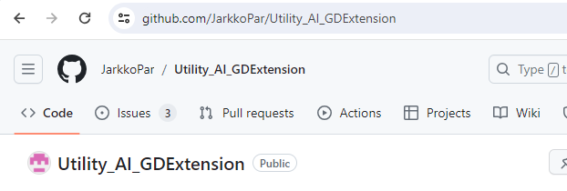
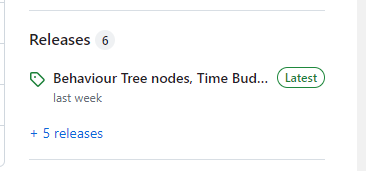
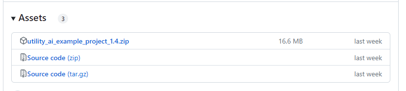

# How to install Utility AI GDExtension

You can install Utility AI GDExtension can be done in two ways: 

 * Through the Godot AssetLib within the Godot Engine
 * By downloading from the Utility AI GDExtension github site as zip, extracting and copying it to the project folder

## Installation through the Godot AssetLib within the Godot Engine

To install the Utility AI GDExtension within the Godot Engine do the following steps:

1. In the menu on the top of the screen, click on AssetLib.

2. The AssetLib interface should open up. In the AssetLib inteface, search for Utility AI. Then click on the Utility AI (GDExtension) icon.

3. The dialog for downloading the extension will open. Click the Download-button to download the extension.

4. After the download finishes, you will be shown all the files included in the extension. You will need all of the files, so just click the Install-button.

5. The files will be installed and after a successful installation you should see a message box with the text: `Asset "Utility AI (GDExtension)" installed successfully!`. Click on OK to close the message box.

You should see in your FileSystem tab the `addons` folder and within it the utility_ai extension. The Utility AI nodes should be available when you add new nodes in to your scenes.

Congratulations! You have now installed the Utility AI GDExtension to your Godot project. 

 * **What if I get an error during the installation process?** So far no one has ever reported about errors during the installation using the AssetLib. If you get errors, please post an issue in the [issues list in github](https://github.com/JarkkoPar/Utility_AI_GDExtension/issues).

## Installation by downloading from Github

The extension can also be installed by downloading the package from the github page and installing it manually. Follow these steps to do so:

1. Go to the url https://github.com/JarkkoPar/Utility_AI_GDExtension.

2. On the right-hand side of the page you should see **Releases**. The latest release is shown under the Releases-heading (note that the text may be different from the image for the latest release), so click on the latest release.

3. You will go to the page with information about the latest release. Scroll down on the page until you see the **Assets**. To download only the extension, click on the `Source code (zip)` link. You can also download the example project to see implementation examples.

4. Once the download completes, extract all the files in the zip-file to a folder and open the folder.

5. In the folder you just opened, you will likely see a subfolder named something like `Utility_AI_GDExtension-X.X`, where X.X is the version number of the extension. If so, open that folder and you will find the `addons` folder.

6. To install the extension to your project, copy the addons-folder to your Godot project root folder. 

When you open your Godot project, you should see in your FileSystem tab the `addons` folder and within it the utility_ai extension. The Utility AI nodes should be available when you add new nodes in to your scenes.

 

Congratulations! You have now installed the Utility AI GDExtension to your Godot project. 

 * **What if I get an error during the manual installation process?** So far no one has ever reported about errors during a manual installation. If you get errors, please post an issue in the [issues list in github](https://github.com/JarkkoPar/Utility_AI_GDExtension/issues).

