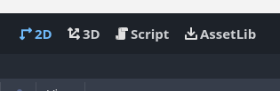
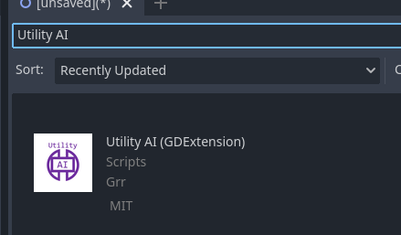
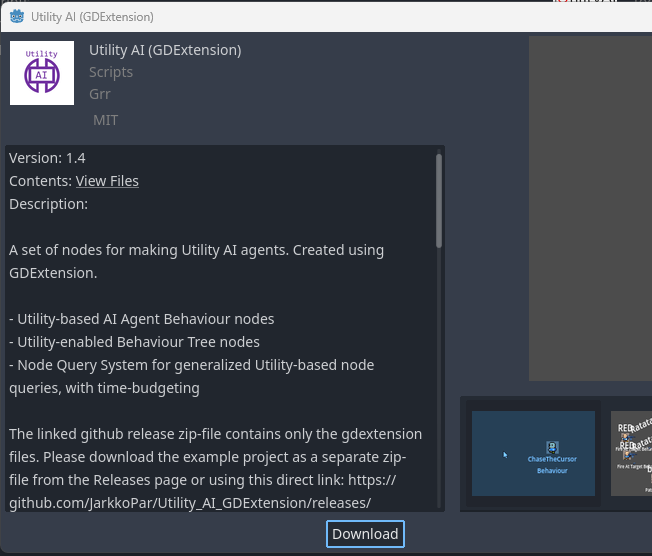
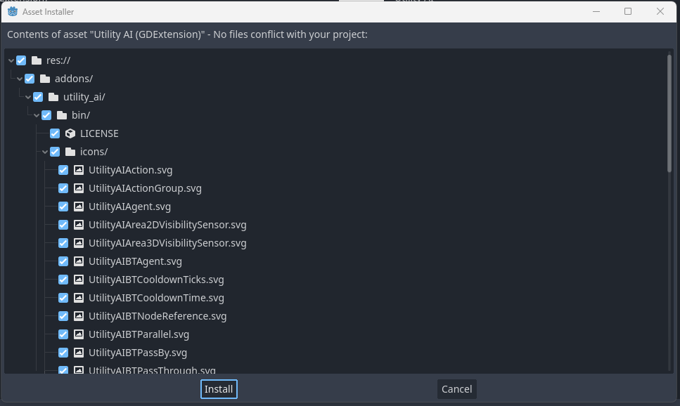
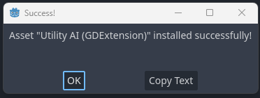

# How to install Utility AI GDExtension

You can install Utility AI GDExtension can be done in two ways: 

 * Through the Godot AssetLib within the Godot Engine
 * By downloading from the Utility AI GDExtension github site as zip, extracting and copying it to the project folder

## Installation through the Godot AssetLib within the Godot Engine

To install the Utility AI GDExtension within the Godot Engine do the following steps:

1. In the menu on the top of the screen, click on AssetLib.

2. The AssetLib interface should open up. In the AssetLib inteface, search for Utility AI. Then click on the Utility AI (GDExtension) icon.

3. The dialog for downloading the extension will open. Click the Download-button to download the extension.

4. After the download finishes, you will be shown all the files included in the extension. You will need all of the files, so just click the Install-button.

5. The files will be installed and after a successful installation you should see a message box with the text: `Asset "Utility AI (GDExtension)" installed successfully!`. Click on OK to close the message box.

 * **What if I get an error during the installation process?** So far no one has ever reported about errors during the installation using the AssetLib. If you get errors, please post an issue in the [issues list in github](https://github.com/JarkkoPar/Utility_AI_GDExtension/issues).

## Installation by downloading from Github

