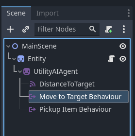

# Tutorial
This tutorial shows how to create a simple AI Agent with two behaviours.

# Create the test scene
To get started, we need a scene where the AI Agent will do its thing. Create a Node2D scene and add a Sprite2D. Rename the Node2D to "MainScene" and the Sprite2D to what ever you want (I named mine "Entity") and add some sprite to it. Then attach a script to the Sprite2D you created and another to the MainScene. Finally, add a Label and set its text as "item" - this is a very programmer-artsy way of creating an item for the AI-entity to pick up ;) As a result you should have the MainScene node and under that two child nodes: the Label and the Sprite2D nodes.

Now that we have something to display on the screen, let's create the AI Agent node structure.

# Creation of the AI Agent node structure
The main node for the Utility AI GDExtension is the AI Agent node. It is under this node all the other nodes will be placed. So add an AI Agent node to your test scene, as a child of the Sprite2D. 
|Add the AI Agent node|
|--|
||

We will be making a real-time example, so select the AI Agent node if it is not yet selected and change the "Thinking Delay in Seconds" property to 0.1. This makes the AI Agent do its reasoning more often. Leave the "Num Behaviours to Select" property to 1, which means the AI Agent will always select the best behaviour it can find. If you increase this value the AI Agent will choose randomly one of the top N behaviours, where N is the value you set to the property "Num Behaviours to Select".

## Adding Sensors

The AI Agent uses `sensors` to observe what happens in the game world. For this tutorial we will create a random item that the AI will go to and pick up, so a thing of interest would be the _distance_ to the item. That will be our sensor. Add a UtilityAISensor node as the child of the UtilityAIAgent and rename it to DistanceToTarget.
|Add the Sensor node|
|--|
||

For the Utility AI GDExtension each sensor should have a floating point input value between 0 and 1. 

## Adding the Behaviours
The AI Agents works by evaluating different behaviours that have been defined for it. We will now add two behaviour nodes and use the Consideration and Action nodes to build their logic. Add two UtilityAIBehaviour nodes as the child of the AI Agent node. Name them "Move to Target Behaviour" and "Pickup Item Behaviour". 
|Add the Behaviour nodes|
|--|
||

## Adding the Considerations
The AI Agent uses Considerations to decide what it should consider when scoring the behaviours. Each Consideration can use a Sensor as its input. If you don't set a sensor, it uses the "Activation Input Value" property as-is.

Add a UtilityAIConsideration node as the child of the "Move to Target Behaviour" node. Then rename it to "Am I Far Away from Target".
|Add the first Consideration node|
|--|
||

Select the "Am I Far Away from Target" node and in the Inspector, assign the "Input Sensor Node Path" to the DistanceToTarget sensor node. Once set, the sensor will set the "Activation Input Value" automatically when the AI Agent evaluates its options.
|Set the sensor|
|--|
||

The last thing we need to do is to set the "Activation Curve" property. This defines how the Consideration will evaluate the "Activation Input Value" property. Add a new Curve and set it to a curve where the Y-value is 0 when X-value is close to 0, and when X approaches 1 the Y value will increase. This means that as the DistanceToTarget sensor value increases, so does the Consideration score, which in turn will make the "Move to Target Behaviour" more likely to be chosen. 
|Set the activation curve|
|--|
||

Now, add a Consideration node as the child of the "Pickup Item Behaviour" and name it "Am I Near the Target". Set the sensor as the DistanceToTarget sensor. Create a new Activation Curve, but this time have the curve have a high Y-value when X is near to 0, and otherwise Y should be 0. This will make the "Pickup Item Behaviour" be less likely to be chosen when the AI Agent is farther away to the target.
|Set the activation curve for the other consideration|
|--|
||

## Adding the Actions
We're almost done with the node structure! The last thing we need to do for the Behaviours is to add Actions to them. When the AI Agent has chosen a behaviour based on an evaluation of their Considerations, it will execute the Actions you have defined for the Behaviour. You can add as many actions as you like and you can even use the UtilityAIActionGroup node to group your actions and set if the actions should be executed as a sequence or just one of them to be picked randomly.

In our case we will add just one action for each of the behaviours and name them as "Move" and "Pickup". So do just that, add a UtilityAIAction node as the child of both Behaviour nodes, and them rename them as noted.
|Add the Action nodes|
|--|
||

The action nodes contain two main properties: "Action ID" and "Is Finished". 

The "Action ID" can be used to define integer-based ID's for identifying which action is running in your code. An alternative to that is to use the action's node name. 

The "Is Finished" property, however, is important for the AI Agent's functionality. The AI Agent doesn't care what you do with each of the actions, but it does care to know when an action is finished. This allows it to step to the next action on the behaviour. 

We are now done with the node structure. Next, we will write the code needed to run the AI.

# Wiring it all up
In an earlier step we added the script to the Sprite2D node, now it is time to add the functionality to it. 

## Getting _ready()

Add variables `ai` of type UtilityAIAgent, `sensor_distance_to_target` of type UtilityAISensor, `current_action` of type UtilityAIAction, `speed` of type float and `target_position` of type Vector2 as global variables for the script. 

We add one signal, picked_up_item, that is used to notify the main scene that the position of the item should be updated.

In the `_ready()` function, set the `ai` as the UtilityAIAgent node, the `sensor_distance_to_target` as the only sensor we created and then set `current_action` as null and the speed to 0.0, and the target_position as a zero vector. 

```gdscript
var ai:UtilityAIAgent
var sensor_distance_to_target:UtilityAISensor
var current_action:UtilityAIAction
var speed:float
var target_position:Vector2

signal picked_up_item


func _ready():
	ai = $UtilityAIAgent
	sensor_distance_to_target = $UtilityAIAgent/DistanceToTarget
	current_action = null
	speed = 0.0
	target_position = Vector2.ZERO
```

## The _process(delta) function
For this tutorial we'll use the _process(delta) function to update the AI Agent. We'll use a 3-step process for the update:
 1. Sense
 2. Think
 3. Act

The _sense_ part focuses on updating the sensors for the AI Agent to sense what is happening in the game world. 
The _think_ part focuses on using the Behaviours and the Consideration node structure of the AI Agent to reason about what behaviour would be best suited for the current situation and choosing a _behaviour_. This boils down to two method calls for the AI Agent node.
The _act_ part focuses on realizing the _actions_ the chosen behaviour contains. You can freely define what each action does.

The full _process(delta) function can be seen below. After the code we'll walk through what the code does, exactly.

```gdscript
func _process(delta):
	# Sense
	var vec_to_target = target_position - position 
	var distance = vec_to_target.length()
	sensor_distance_to_target.sensor_value = distance / 1000.0
	
	# Think
	ai.evaluate_options(delta)
	ai.update_current_behaviour()
	
	# Act
	if current_action == null:
		return
	
	# Update the position
	position += delta * speed * vec_to_target.normalized()
	
	# Update otherwise based on current action.
	if current_action.name == "Move":
		if distance <= 4.0:
			current_action.is_finished = true
	elif current_action.name == "Pickup":
		emit_signal("picked_up_item")
		current_action.is_finished = true

```
In the _sense_ part the sensor value is updated with a normalized distance, meaning that the distance is scaled to a value between 0 and 1. 

After that in the _think_ part the AI Agent evaluate_options() method and the update_current_behaviour() method are called. The first one chooses one of the available behaviours based on the score it received from evaluating its considerations, and the second one steps the actions within a behaviour, choosing one of the actions as the current one. This will trigger the signals behaviour_changed and action_changed for the AI Agent.

Finally, in the _act_ part the entity is updated based on the current action. Because the actions alter the speed of the entity, the position is always updated, and the actions focus on checking when they are finished. The move-action finishes when the entity is close enough to the target position. The pickup action does the picking up - in this case it just emits the signal - and is then immediately set as finished.

In the next section fo this tutorial we handle the change of behaviour and action.

## Change of behaviour or action
When a behaviour or action changes, the AI Agent emits a signal. We will use this signal to choose the actions. In more complex scenarios you will likely want to use bot the behaviour_changed and the action_changed signals, but for this simple tutorial all we need to use is the action_changed signal. 

|Connect the Action Changed signal|
|--|
||

Then add the below code to the handler function. It checks if the new action is different from before. If it is, and the curren action is not the same as the new one, the action that is running is ended using the end_action() function. If the new action wasn't null, it is started using the start_action() function. We will define both of these functions in a moment.
```gdscript
func _on_utility_ai_agent_action_changed(action_node):
	if action_node == current_action:
		return
	if current_action != null:
		end_action(current_action)
	current_action = action_node
	if current_action != null:
		start_action(current_action)
```

The start_action() and end_action() functions do initialization when an action is starting and cleanup when it is ending.

In the start_action() function we set the speed of the entity based on what action we are currently doing.

```gdscript
func start_action(action_node):
	if current_action.name == "Move":
		speed = 100.0
	elif current_action.name == "Pickup":
		speed = 0.0

```

For end_action() function we don't currently do anything, but it is included as an example.
```gdscdript
func end_action(action_node):
	if current_action.name == "Move":
		pass
	elif current_action.name == "Pickup":
		pass

```

## The full script
The full script for the Sprite2D-node looks like this:
```gdscript
extends Sprite2D

var ai:UtilityAIAgent
var sensor_distance_to_target:UtilityAISensor
var current_action:UtilityAIAction
var speed:float
var target_position:Vector2

signal picked_up_item


func _ready():
	ai = $UtilityAIAgent
	sensor_distance_to_target = $UtilityAIAgent/DistanceToTarget
	current_action = null
	speed = 0.0
	target_position = Vector2.ZERO


func _process(delta):
	# Sense
	var vec_to_target = target_position - position 
	var distance = vec_to_target.length()
	sensor_distance_to_target.sensor_value = distance / 1000.0
	
	# Think
	ai.evaluate_options(delta)
	ai.update_current_behaviour()
	
	# Act
	if current_action == null:
		return
	
	# Update the position
	position += delta * speed * vec_to_target.normalized()
	
	# Update otherwise based on current action.
	if current_action.name == "Move":
		if distance <= 4.0:
			current_action.is_finished = true
	elif current_action.name == "Pickup":
		emit_signal("picked_up_item")
		current_action.is_finished = true


func _on_utility_ai_agent_action_changed(action_node):
	if action_node == current_action:
		return
	if current_action != null:
		end_action(current_action)
	current_action = action_node
	if current_action != null:
		start_action(current_action)


func start_action(action_node):
	if current_action.name == "Move":
		speed = 100.0
	elif current_action.name == "Pickup":
		speed = 0.0


func end_action(action_node):
	if current_action.name == "Move":
		pass
	elif current_action.name == "Pickup":
		pass

```

# The MainScene script
In the MainScene script is very simple. We first set a random position to the label and set the target position for the entity as the label position. Then in the handler for the Sprite2D-nodes "picked_up_item" signal we set another random position for the label and again set the target position for the Sprite2D-node.

```gdscdript
extends Node2D

var label:Label


func _ready():
	randomize()
	label = $Label
	label.position = Vector2(get_viewport_rect().end.x * randf(), get_viewport_rect().end.y * randf())
	$Entity.target_position = label.position


func _on_entity_picked_up_item():
	label.position = Vector2(get_viewport_rect().end.x * randf(), get_viewport_rect().end.y * randf())
	$Entity.target_position = label.position

```

# The result
As a result you now should have an entity that goes to the label, picks it up and then goes to the new position of the label.

Congratulations! You have now created your first AI entity with Utility AI GDExtension!