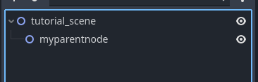
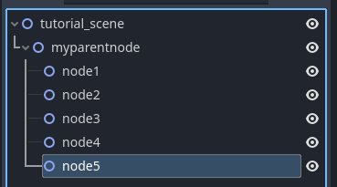
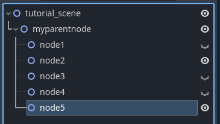
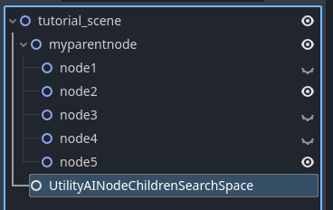
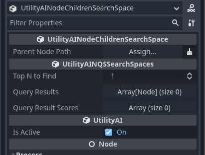
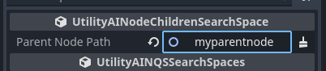
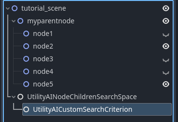
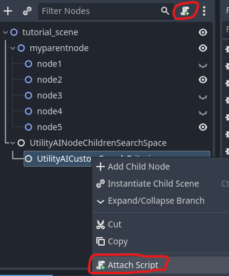
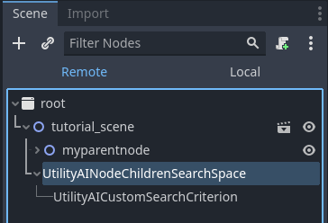
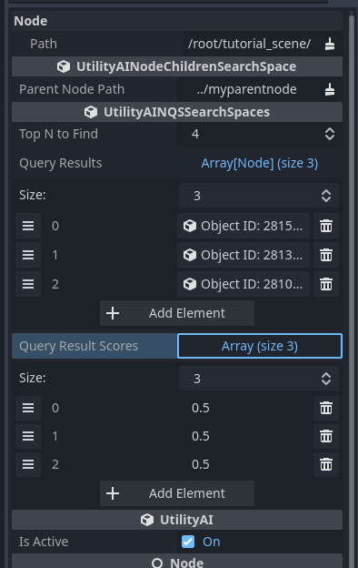

# Tutorial
This tutorial shows how to create a simple query using the Node Query System.

# Create the test scene
To get started, we need a scene with some nodes to use in the query. Create a 2D scene with some name, I named mine "tutorial_scene". Add another Node2D as a child and name it "myparentnode".

|My Parent Node|
|--|
||

Under the searchspace node, add 5 Node2D's and name them as node1, node2, ..., node5. These are the nodes we will be searching through. 

|Nodes to search through|
|--|
||

We'll adjust the properties of these nodes to make it more interesting for the search. Set a couple of the nodes as hidden.

|Hidden nodes|
|--|
||

Now that we have a... kind of interesting search space, let's make add the Node Query System nodes to make queries about them.

# Adding the Node Query System nodes
The main node for the Node Query System is always the Search Space node. Add a `UtilityAINodeChildrenSearchSpace` node as the child of the scene root node (mine was called tutorial_scene). 
|The Search Space|
|--|
||

The Search Space is used to define the set of nodes which you want to search through. In the case of the NodeChildrenSearchSpace it will be the direct children of some node. Look in the Inspector, and you can see the properties of this search space, and there you will se a node path you can set to a parent node.

|The Search Space properties in the Inspector|
|--|
||

Set the `myparentnode` as the Parent Node Path. You have now defined what the search space is for the NodeChildrenSearchSpace.

|The Search Space, defined|
|--|
||

The shared properties for all search spaces are the number of top N nodes to return (default is 1), and the query results (an array of nodes) and their scores (an array of floats). Setting the top N to a larger value allows you to take a random one of the best choices found, for instance. For this tutorial, change the top N to 4. This means that you will get at maximum a list of 4 nodes as the query results. The result can be less, though, if there aren't that many nodes left after filtering. 

Setting the top N to a larger value allows you to choose a random node amongst the top N nodes. This can give some variability to your AI, so that they don't always choose the same or the best possible option. 


## Adding Criteria

The search space uses `Search Criteria` nodes when it is executing the search query. In this case we will use the `UtilityAICustomSearchCriterion` to write a custom search, but there are pre-made choices available as well.
|Add the Search Criterion node|
|--|
||

The shared properties for all the search criteria are `Use for Scoring`, `Use for Filtering`, `Score`, `Is Filtered` and the `Activation Curve`. If `Use for Scoring` is checked, the search criterion is used to score the nodes in the search space. If `Use for Filtering` is checked, the criterion will filter out the nodes that do not match the properties of the search criterion. 

The `Activation Curve` can be used to change the outcome of the `Score` after the search criterion has applied its rules to the node. For instance, for a distance search, by default a node will get a low score if it is nearby and a high score if it is far away. With the `Activation Curve` you can change the scoring to something different. For instance, you can set that middle distances get a high score and all others zero.

You can add any number of criteria as the children of a search space node. The total score for the nodes is calculated by multiplying the scores of the different criteria together.


## Adding the code
The last two things to do is to add the code to run the search space query and the `apply_criterion()` method for the Custom Search Criterion. We'll first add the code for the custom search criterion.

Choose the UtilityAICustomSearchCriterion node and attach a script to it by using the Attach Script button or via the right-click menu.
|Adding the script|
|--|
||

Then add the following code, which filters out the node if it is visible and sets the score of 0.5 to all the nodes:

```gdscript
extends UtilityAICustomSearchCriterion


func apply_criterion(node:Node) -> void:
	is_filtered = node.visible
	score = 0.5

```

Lastly, we will add the code to execute the query. Choose the root node of the scene (in my case it is the `tutorial_scene` node) and attach a script to it. Then add the following code:

```gdscript
extends Node2D


# Called every frame. 'delta' is the elapsed time since the previous frame.
func _process(delta):
	$UtilityAINodeChildrenSearchSpace.execute_query()

```

This script runs the search space query every frame. In an actual game you don't usually want to do that, rather run the query when ever it is actually needed. But for this tutorial it works just fine.


## Testing it out
We're now ready to test the query. Click on Run Current Scene (or press F6) and you are greeted with a gloriously empty screen. To see the query results, go to the Godot Editor and in the Scene-tab, click Remote, then choose the Search Space node.
|Choosing Remote|
|--|
||

In the Inspector, exand the Query Results and the Query Result Scores. You can see the resulting nodes and their scores (which should be 0.5 for all of them). By double-clicking on the node you can check that the `visible` property is `false` for the nodes that were found (remember, the is_filtered property was set as the visible property).
|The query results|
|--|
||


# The result
As a result you now have created a simple query using the Node Query System and seen what it returns. You can experiment by moving the nodes 1-5 to different locations and then adding the `UtilityAIDistanceToVector2SearchCriterion` as a child of the `UtilityAINodeChildrenSearchSpace` and setting the `Distance To Vector` on the criterion to some value.

Congratulations! You have now created your first Node Query System utility query with Utility AI GDExtension!