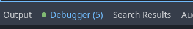

# Using the AIPerformanceMonitor

The AIPerformanceMonitor-singleton included in the Utility AI GDExtension can be used to monitor the time the AI components you use consume each frame. This allows you to optimize the frame time the AI consumes and to improve the performance of your game. 


## Available monitors

The AIPerformanceMonitor-singleton has the following measures available:

 * AI Agent evaluate options time usec
 * AI Agent update behaviour time usec
 * Behaviour Tree tick time usec
 * State Tree tick time usec

**AI Agent evalute options time usec** is the total time per frame, in microseconds, used for running the AI Agent's `evaluate_options()` method. 

**AI Agent update behaviour time usec** is the total time per frame, in microseconds, used for running the AI Agent's `update_behaviour()` method. 

**Behaviour Tree tick time usec** is the total time per frame, in microseconds, used for running the `tick()` method of Behaviour Trees. 

**State Tree tick time usec** is the total time per frame, in microseconds, used for running the `tick()` method of State Trees.


Note that one millisecond (ms) is 1000 microseconds (usec). If your game is running at 60 frames per second, one frame would have the theoretical time of 16.6 milliseconds, meaning 16,600 microseconds. 

In practice the time you have available for your AI is much less than 16,600 microseconds (usec). You likely have some other processing going on, Godot is doing its own processing and there usually are various inefficiencies that reduce the available time further. However, by being able to monitor how much time your AI is using per frame you can start optimizing and set a time budget per frame for your AI. 


## Setting up the AIPerformanceMonitor 

> [!IMPORTANT]
> This information applies to the Godot 4.1 version of the Utility AI GDExtension.

To set up the AIPerformanceMonitor, you need to call the `initialize_performance_counters()` method of the singleton. In your main scene, in the `_ready()` method, add the following code:

```gdscript

func _ready():
    AIPerformanceMonitor.initialize_performance_counters()

    # Your other initialization code can be added here.
    pass
```

This will initialize the counters and add them to the Godot Engine performance monitor. The counters still need to be updated per frame. This is done by adding a call to the `update_performance_counters()` method in the `_physics_process()` method of your main scene:

```gdscript
func _physics_process(delta):
    AIPerformanceMonitor.update_performance_counters()

    # Your other update code can be added here.
    pass
```

It doesn't matter where in the `_ready()` method the `initialize_performance_counters()` is called or where in the `_physics_process()` method the `update_performance_counters()` is called. What is important is that the initialization method is called once when your application is starting and the update method only once during each physics frame.


## Enabling the monitors

You can enable the monitors through the Debugger-menu as follows:

 1. Click on the Debugger-menu at the bottom of the Godot Engine editor.




 2. Click on the Monitors-tab and scroll down until you see the UtilityAI measures. Check the checkboxes on the ones you want to monitor.


 3. After checking the measures you want to follow, you will see the graphs of the measures to the right of the list of the monitors.


