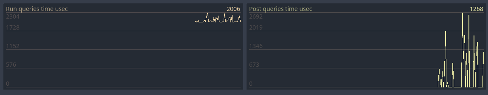

# Using the NodeQuerySystem performance monitoring

The NodeQuerySystem-singleton included in the Utility AI GDExtension can be used to monitor the time the NQS-queries you use consume each frame. This allows you to optimize the frame time the NodeQuerySystem consumes and to improve the performance of your game. 

## Available monitors

The NodeQuerySystem-singleton has the following measures available:

 * Run queries time usec
 * Post queries time usec

**Run queries time usec** is the total time per frame, in microseconds, used for running the NQS queries you have posted to the NodeQuerySystem-singleton using the `post_query()` method. You can set a cap to the time the NodeQuerySystem-singleton uses per physics frame for running the queries, and this monitor is a good way to monitor how closely the set time budget is followed.

**Post queries time usec** is the total time per frame, in microseconds, used for running the `post_query()` method of the NodeQuerySystem-singleton. It is not possible to set a time budget for this method per physics frame in the current version of Utility AI GDExtension. 


Note that one millisecond (ms) is 1000 microseconds (usec). If your game is running at 60 frames per second, one frame would have the theoretical time of 16.6 milliseconds, meaning 16,600 microseconds. 

In practice the time you have available for the NodeQuerySystem is much less than 16,600 microseconds (usec). You likely have some other processing going on, Godot is doing its own processing and there usually are various inefficiencies that reduce the available time further. However, by being able to monitor how much time the Node Query System is using per frame you can start optimizing the way you post your queries. 

One successful strategy is to spread out the calls to the `post_query()` method to several frames. Another is to post the queries for far away AI entities less often than those that are near to the player.


## Setting up the NodeQuerySystem performance monitors 

> [!IMPORTANT]
> This information applies to the Godot 4.1 version of the Utility AI GDExtension.

To set up the NodeQuerySystem monitors, you need to call the `initialize_performance_counters()` method of the singleton. In your main scene, in the `_ready()` method, add the following code:

```gdscript

func _ready():
    NodeQuerySystem.initialize_performance_counters()

    # Your other initialization code can be added here.
    pass
```

This will initialize the counters and add them to the Godot Engine performance monitor. The counters will be updated during the call to the `run_queries()` method:

```gdscript
func _physics_process(delta):
    NodeQuerySystem.run_queries()

    # Your other update code can be added here.
    pass
```

It doesn't matter where in the `_ready()` method the `initialize_performance_counters()` is called or where in the `_physics_process()` method the `run_queries()` is called. What is important is that the initialization method is called once when your application is starting and the run_queries method only once during each physics frame.


## Enabling the monitors

You can enable the monitors through the Debugger-menu as follows:

 1. Click on the Debugger-menu at the bottom of the Godot Engine editor.


 2. Click on the Monitors-tab and scroll down until you see the NodeQuerySystem measures. Check the checkboxes on the ones you want to monitor.


 3. After checking the measures you want to follow, you will see the graphs of the measures to the right of the list of the monitors.




